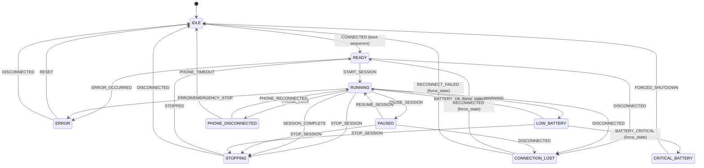

# BlueBuzzah Firmware Architecture
**Version:** 2.0.0
**Platform:** CircuitPython 9.x on nRF52840

---

## Table of Contents

1. [System Overview](#system-overview)
2. [Architecture Principles](#architecture-principles)
3. [Module Organization](#module-organization)
4. [Role-Based Architecture](#role-based-architecture)
5. [Entry Point Flow](#entry-point-flow)
6. [Hardware Abstraction](#hardware-abstraction)
7. [State Management](#state-management)
8. [Error Handling Strategy](#error-handling-strategy)
9. [Heartbeat Protocol](#heartbeat-protocol)
10. [Memory Management](#memory-management)
11. [Development Guidelines](#development-guidelines)

---

## System Overview

BlueBuzzah implements a **PRIMARY-SECONDARY architecture** for bilateral haptic therapy using two synchronized gloves communicating via Bluetooth Low Energy (BLE).

### Design Philosophy

**Unified Codebase**: Both gloves run identical firmware with role-aware behavior controlled by `config.py` and `settings.json`:

```python
# config.py - Role detection from settings.json
def load_device_config():
    with open("/settings.json") as f:
        data = json.load(f)
    return {
        'role': DeviceRole.PRIMARY if data['deviceRole'] == 'Primary' else DeviceRole.SECONDARY,
        'ble_name': 'BlueBuzzah',
        'device_tag': f"[{data['deviceRole']}]"
    }

# settings.json for PRIMARY device
{"deviceRole": "Primary"}

# settings.json for SECONDARY device
{"deviceRole": "Secondary"}
```

**Benefits of Unified Architecture:**
- **Single source of truth**: Bug fixes and improvements apply to both gloves automatically
- **Simplified testing**: Desktop simulation possible without hardware dependencies
- **Streamlined deployment**: `deploy.py` manages role-specific configuration
- **Consistent behavior**: Identical code paths ensure predictable bilateral operation

---

## Architecture Principles

### 1. **Role Polymorphism**
Modules adapt behavior based on `GLOVE_ROLE`:

```python
# BLE Connection
if role == "PRIMARY":
    return self._primary_advertise_and_wait()
else:
    return self._secondary_scan_and_connect()

# VCR Engine
if role == "PRIMARY":
    send_execute_buzz(uart, sequence_idx)
    haptic.buzz_sequence(pattern)
else:
    sequence_idx = receive_execute_buzz(uart)  # Blocking
    haptic.buzz_sequence(pattern)
```

### 2. **Command-Driven Synchronization**
PRIMARY explicitly commands SECONDARY for every action using SYNC protocol:

```
PRIMARY → SECONDARY: SYNC:EXECUTE_BUZZ:left_finger|2|right_finger|2|amplitude|100
PRIMARY: <executes local buzz>
SECONDARY: <waits for command, then executes>
```

**Why not time-based?**
- Eliminates clock drift over 2-hour sessions
- Guarantees bilateral synchronization (±7.5ms BLE latency)
- Simplifies error recovery (SECONDARY halts if PRIMARY disconnects)

### 3. **Multi-Connection Support** (PRIMARY Only)
PRIMARY supports **simultaneous connections** to:
1. **Smartphone** (phone_connection) - Configuration, monitoring, control
2. **SECONDARY glove** (secondary_connection) - Bilateral therapy coordination

**Connection Detection:**
```python
# Boot sequence handles connection establishment
# PRIMARY advertises as "BlueBuzzah"
# SECONDARY scans for "BlueBuzzah" and connects
# Phone app connects to PRIMARY for control
```

### 4. **Separation of Concerns**

| Module | Responsibility | Depends On |
|--------|---------------|------------|
| `main.py` | Entry point | `app.py` |
| `app.py` | Application orchestrator, boot sequence | All modules |
| `ble.py` | BLE radio, connection management | `adafruit_ble` |
| `therapy.py` | Therapy execution, pattern generation | `hardware`, `sync` |
| `hardware.py` | Motor control, battery, I2C multiplexer | `adafruit_drv2605` |
| `menu.py` | BLE command processing | `profiles`, `application/session` |
| `sync.py` | PRIMARY↔SECONDARY message passing | `ble` |
| `profiles.py` | Therapy parameter management | `utils/validation` |
| `state.py` | Therapy state machine | `core/types` |
| `application/session/manager.py` | Session lifecycle | `state`, `therapy` |
| `application/calibration/controller.py` | Motor testing | `hardware` |

---

## Module Organization

```
src/
├── main.py                         # Entry point
├── app.py                          # Main application orchestrator (BlueBuzzahApplication)
├── config.py                       # Device-specific configuration
├── boot.py                         # Boot configuration (USB/storage mode)
│
├── application/                    # Application layer
│   ├── __init__.py
│   ├── session/
│   │   ├── __init__.py
│   │   └── manager.py              # Session lifecycle management
│   └── calibration/
│       ├── __init__.py
│       └── controller.py           # Calibration workflows
│
├── core/                           # Core types and constants
│   ├── __init__.py
│   ├── types.py                    # DeviceRole, TherapyState, enums
│   └── constants.py                # System constants (FIRMWARE_VERSION, etc.)
│
├── utils/                          # Utilities
│   ├── __init__.py
│   └── validation.py               # Parameter validation
│
├── ble.py                          # BLE connection management
├── therapy.py                      # Therapy engine (pattern generation, execution)
├── hardware.py                     # DRV2605Controller, BatteryMonitor, I2CMultiplexer
├── menu.py                         # BLE command processing (MenuController)
├── sync.py                         # PRIMARY↔SECONDARY messaging protocol
├── state.py                        # TherapyStateMachine
├── led.py                          # LEDController (boot and therapy modes)
├── profiles.py                     # ProfileManager, therapy profiles
└── sync_stats.py                   # Sync statistics (validation/debugging)
```

**Architecture Layers:**
- **Presentation**: `led.py`, `menu.py` (BLE command interface)
- **Application**: `application/session/`, `application/calibration/`
- **Domain**: `therapy.py`, `sync.py`, `state.py`
- **Infrastructure**: `ble.py`, `hardware.py`, `profiles.py`

---

## Role-Based Architecture

### PRIMARY (Left Glove)

**Responsibilities:**

1. **Advertise** as BLE peripheral ("BlueBuzzah")
2. **Accept connections** from smartphone + SECONDARY
3. **Execute boot sequence**: Wait for SECONDARY, optionally phone
4. **Orchestrate therapy**: Send SYNC:EXECUTE_BUZZ commands
5. **Send heartbeats** to SECONDARY during therapy
6. **Broadcast parameters** to SECONDARY on profile changes
7. **Process smartphone commands** via MenuController

**Key Methods (app.py):**

- `BlueBuzzahApplication._primary_boot_sequence()` - Boot and connection
- `BlueBuzzahApplication._run_primary_loop()` - Main therapy loop
- `SessionManager.start_session()` - Sends SYNC:START_SESSION to SECONDARY
- `TherapyEngine.update()` - Pattern generation and motor control

### SECONDARY (Right Glove)

**Responsibilities:**

1. **Scan** for "BlueBuzzah" BLE advertisement
2. **Connect** to PRIMARY during boot sequence
3. **Receive SYNC commands**: START_SESSION, EXECUTE_BUZZ, HEARTBEAT
4. **Execute synchronized buzzes** after command received
5. **Monitor heartbeat timeout** (6 seconds)
6. **Safety halt** if PRIMARY disconnects or heartbeat times out

**Key Methods (app.py):**

- `BlueBuzzahApplication._secondary_boot_sequence()` - Scan and connect
- `BlueBuzzahApplication._run_secondary_loop()` - Wait for SYNC commands
- `BlueBuzzahApplication._handle_sync_command()` - Process SYNC messages
- `BlueBuzzahApplication._handle_heartbeat_timeout()` - Connection recovery

---

## Entry Point Flow

### main.py → app.py Execution Sequence

```python
# main.py
from app import BlueBuzzahApplication
import config

def main():
    # 1. Load configuration from settings.json
    device_config = config.load_device_config()
    therapy_config = config.load_therapy_config()

    # 2. Create and run application
    app = BlueBuzzahApplication(device_config, therapy_config)
    app.run()

# app.py - BlueBuzzahApplication.run()
def run(self):
    # 1. Execute boot sequence (role-specific)
    if SKIP_BOOT_SEQUENCE:
        self.boot_result = BootResult.SUCCESS_NO_PHONE
    else:
        self.boot_result = self._execute_boot_sequence()

    if self.boot_result == BootResult.FAILED:
        self.boot_led_controller.indicate_failure()
        return

    # 2. Switch to therapy LED mode
    self._switch_to_therapy_led()

    # 3. Enter role-specific main loop
    if self.role == DeviceRole.PRIMARY:
        self._run_primary_loop()
    else:
        self._run_secondary_loop()
```

**Boot Sequence (PRIMARY):**

1. Initialize BLE and advertise as "BlueBuzzah"
2. LED: Rapid blue flash during connection wait
3. Wait for SECONDARY connection (required)
4. Optionally wait for phone connection
5. Success: Solid blue LED

**Boot Sequence (SECONDARY):**

1. Initialize BLE and scan for "BlueBuzzah"
2. LED: Rapid blue flash during scanning
3. Connect to PRIMARY within timeout
4. Success: Solid blue LED

**Timing Breakdown:**

- Boot sequence: 0-30s (configurable startup_window_sec)
- Connection handshake: 2-15s
- Therapy execution: 2-180 minutes
- Shutdown: <1s

---

## Hardware Abstraction

### Haptic Controller Architecture

```
[HapticController]
    └── I2C Bus (board.I2C())
        └── TCA9548A Multiplexer (0x70)
            ├── Port 0: DRV2605 (Thumb)   @ 0x5A
            ├── Port 1: DRV2605 (Index)   @ 0x5A
            ├── Port 2: DRV2605 (Middle)  @ 0x5A
            └── Port 3: DRV2605 (Ring)    @ 0x5A
```

**I2C Initialization Strategy** (hardware.py - DRV2605Controller):

```python
# 1. Try standard board.I2C() (3 retries with 0.5s delay)
for attempt in range(3):
    try:
        self.i2c = board.I2C()
        break
    except RuntimeError:
        time.sleep(0.5)

# 2. Fallback: Manual init with frequency stepping
frequencies = [100000, 50000, 10000]  # 100kHz → 50kHz → 10kHz
for freq in frequencies:
    try:
        self.i2c = busio.I2C(board.SCL, board.SDA, frequency=freq)
        if self.i2c.try_lock():
            self.i2c.unlock()
            break
    except RuntimeError:
        continue

# 3. Failure: Halt with detailed hardware diagnostics
if not initialized:
    print("[CRITICAL] Check SDA/SCL, pull-ups, power supply")
    raise RuntimeError("I2C bus initialization failed")
```

**Why aggressive retry logic?**
CircuitPython's I2C pull-up detection can fail if the bus is not stable at boot time. The firmware compensates with multiple strategies.

### DRV2605 Configuration

**Per-Driver Setup** (hardware.py):

```python
def _configure_driver(driver, config):
    # 1. Set actuator type
    if config.ACTUATOR_TYPE == "LRA":
        driver.use_LRA()  # Linear Resonant Actuator
    else:
        driver.use_ERM()  # Eccentric Rotating Mass

    # 2. Enable open-loop mode (bypass auto-resonance)
    control3 = driver._read_u8(0x1D)
    driver._write_u8(0x1D, control3 | 0x21)  # Set bits 5 and 0

    # 3. Set peak voltage (register 0x17)
    # Formula: voltage / 0.02122
    driver._write_u8(0x17, int(config.ACTUATOR_VOLTAGE / 0.02122))

    # 4. Set driving frequency (register 0x20)
    # Formula: 1 / (frequency * 0.00009849)
    driver._write_u8(0x20, int(1 / (config.ACTUATOR_FREQUENCY * 0.00009849)))

    # 5. Activate Real-Time Playback (RTP) mode
    driver.realtime_value = 0
    driver.mode = adafruit_drv2605.MODE_REALTIME
```

**Register Map:**
- `0x1D` (Control3): Open-loop enable, N/ERM+ mode
- `0x17` (OD_CLAMP): Peak voltage clamping (0-255 = 0-5.6V)
- `0x20` (LRA_PERIOD): Driving period for LRA resonance
- `0x00` (STATUS): Go bit (trigger playback)

---

## State Management

### Therapy State Machine (11 States)

The system has 11 distinct states defined in `core/types.py`:



**Implementation Note:** Battery recovery (LOW_BATTERY → RUNNING) and connection recovery
(CONNECTION_LOST → READY/IDLE) transitions use `force_state()` rather than `transition()`
for immediate state changes without validation. This is intentional for emergency/recovery
scenarios where normal transition guards should be bypassed.

**State Descriptions:**

| State | Description |
|-------|-------------|
| `IDLE` | No active session, system ready |
| `CONNECTING` | Establishing BLE connection during boot |
| `READY` | Connected, ready for therapy |
| `RUNNING` | Active therapy session |
| `PAUSED` | Session paused, can resume |
| `STOPPING` | Session ending, cleanup in progress |
| `ERROR` | Error condition, motors stopped |
| `LOW_BATTERY` | Battery < 20%, session can continue |
| `CRITICAL_BATTERY` | Battery < 5%, forced shutdown |
| `CONNECTION_LOST` | PRIMARY-SECONDARY BLE lost, attempting recovery |
| `PHONE_DISCONNECTED` | Phone BLE lost (PRIMARY only, informational) |

**State Transitions** (state.py):

| From | To | Trigger | Notes |
|------|----|---------|-------|
| IDLE | READY | CONNECTED | After successful boot |
| READY/IDLE | RUNNING | START_SESSION | Profile loaded |
| RUNNING | PAUSED | PAUSE_SESSION | - |
| PAUSED | RUNNING | RESUME_SESSION | - |
| RUNNING/PAUSED | STOPPING | STOP_SESSION | - |
| STOPPING | IDLE | STOPPED | Cleanup complete |
| Any | ERROR | ERROR/EMERGENCY_STOP | Force transition |

**Timing Management (SessionManager):**

```python
# Elapsed time excludes pause durations
elapsed_time = (current_time - session_start_time) - total_pause_time

# Progress percentage
progress = int((elapsed_time / session_duration) * 100)
```

### Connection State (app.py)

**BlueBuzzahApplication connection attributes:**

- `self.phone_connection`: Phone connection object (or None)
- `self.secondary_connection`: SECONDARY glove connection (PRIMARY only)
- `self.primary_connection`: PRIMARY glove connection (SECONDARY only)

**Connection Health Monitoring:**

- PRIMARY sends heartbeats every 2 seconds during therapy
- SECONDARY monitors for heartbeat timeout (6 seconds)
- On timeout: Emergency stop motors, attempt reconnection

---

## Error Handling Strategy

### Hierarchical Error Responses

**Level 1: Fatal Errors** (Halt with LED indicator)

- Boot sequence failure → Red LED flash, halt (app.py)
- I2C initialization failure → Diagnostic message + halt (hardware.py)
- Heartbeat timeout → Emergency stop motors, attempt reconnect (app.py)

**Level 2: Recoverable Errors** (Log + Continue)

- SYNC command timeout → Log warning, proceed
- Battery query timeout → Return None
- File read failure → Return error tuple (profiles.py)

**Level 3: User Errors** (BLE Error Response)

- Invalid command → `ERROR:Unknown command` (menu.py)
- Invalid parameter → `ERROR:Value out of range` (utils/validation.py)
- Command during session → `ERROR:Cannot modify during active session` (menu.py)

### Timeout Handling Matrix

| Operation | Timeout | Failure Action | Location |
|-----------|---------|----------------|----------|
| Boot sequence | 30s | Red LED, halt | app.py |
| BLE scan (SECONDARY) | 30s | Red LED, halt | app.py |
| Heartbeat | 6s | Reconnect attempt | app.py |
| SYNC command | 10s | Log warning | app.py |
| BLE receive | 0.01s | Return None (non-blocking) | app.py |

---

## Heartbeat Protocol

PRIMARY sends periodic heartbeats during therapy to detect silent disconnections (BLE connections that drop without triggering disconnect events).

### Parameters

| Parameter | Value | Description |
|-----------|-------|-------------|
| Interval | 2 seconds | Time between heartbeat messages |
| Timeout | 6 seconds | 3 missed heartbeats = connection lost |
| Recovery attempts | 3 | Number of reconnection attempts |
| Recovery delay | 2 seconds | Delay between reconnection attempts |

### Message Format

```
SYNC:HEARTBEAT:ts|<microseconds>
```

Example: `SYNC:HEARTBEAT:ts|1234567890`

### Protocol Flow

**PRIMARY (sender):**

```python
# In _run_primary_loop() during active therapy
if now - self._last_heartbeat_sent >= HEARTBEAT_INTERVAL_SEC:
    ts = int(time.monotonic_ns() // 1000)  # Microseconds
    self.ble.send(self.secondary_connection, f"SYNC:HEARTBEAT:ts|{ts}")
    self._last_heartbeat_sent = now
```

**SECONDARY (receiver):**

```python
# In _handle_sync_command() for HEARTBEAT
elif command_type == "HEARTBEAT":
    self._last_heartbeat_received = time.monotonic()

# In _run_secondary_loop()
if self._last_heartbeat_received is not None:
    elapsed = time.monotonic() - self._last_heartbeat_received
    if elapsed > HEARTBEAT_TIMEOUT_SEC:
        self._handle_heartbeat_timeout()
```

### Connection Recovery

On heartbeat timeout, SECONDARY executes recovery:

1. Emergency stop all motors (safety)
2. Update state machine to CONNECTION_LOST
3. Update LED to indicate connection lost
4. Attempt reconnection (up to 3 attempts, 2s apart)
5. If successful: Return to READY state
6. If failed: Enter IDLE state

---

## Memory Management

### CircuitPython Constraints
- **RAM**: ~256KB available on nRF52840
- **Storage**: ~2MB flash (CIRCUITPY filesystem)
- **No heap compaction**: Manual gc.collect() required

### Garbage Collection Strategy

**Periodic Collection** (app.py main loops):

```python
# Every 60 seconds in main loop
if int(time.monotonic()) % 60 == 0:
    gc.collect()
    free_mem = gc.mem_free()
    print(f"[MEMORY] Free: {free_mem} bytes")
```

**Why periodic collection?**

- Pattern generation creates temporary lists
- BLE message parsing allocates strings
- Prevents heap fragmentation over long sessions

### Memory-Efficient Patterns

**Bad** (allocates new lists every cycle):
```python
def rndp_sequence():
    L_RNDP = list(permutations(range(0, 4)))  # Allocates 24 tuples
    R_RNDP = list(permutations(range(4, 8)))  # Allocates 24 tuples
    return zip(random.choice(L_RNDP), random.choice(R_RNDP))
```

**Good** (pre-allocate at session start):
```python
# One-time allocation (line 78-79)
L_RNDP = list(permutations(range(0, 4)))
R_RNDP = list(permutations(range(4, 8)))

def rndp_sequence():
    # Reuse existing lists
    return zip(random.choice(L_RNDP), random.choice(R_RNDP))
```

### String Formatting

**Avoid** (f-string backslash continuations not supported):
```python
# CircuitPython ERROR
print(f"Primary: {timestamp} ms | \
         Adjusted: {adjusted} ms")
```

**Use** (format() or multi-line breaks):
```python
# OK
print("Primary: {} ms | Adjusted: {} ms".format(timestamp, adjusted))

# OK
msg = f"Primary: {timestamp} ms"
print(msg)
```

---

## Development Guidelines

### 1. **Role-Aware Code Patterns**

```python
# GOOD: Role check with clear branching (using DeviceRole enum)
if self.role == DeviceRole.PRIMARY:
    # PRIMARY-specific behavior
    self._run_primary_loop()
else:
    # SECONDARY-specific behavior
    self._run_secondary_loop()

# GOOD: Using settings.json for role configuration
# settings.json: {"deviceRole": "Primary"}
```

### 2. **BLE Message Protocol**

**Phone → PRIMARY Commands:**

```
COMMAND_NAME:ARG1:ARG2:...\n
```

**PRIMARY → Phone Responses:**

```
KEY1:VALUE1\n
KEY2:VALUE2\n
\x04
```

**PRIMARY ↔ SECONDARY SYNC Messages:**

```
SYNC:<command>:<key1>|<val1>|<key2>|<val2>
```

**SYNC Commands:**

| Command | Direction | Description |
|---------|-----------|-------------|
| START_SESSION | P→S | Begin therapy with config |
| PAUSE_SESSION | P→S | Pause current session |
| RESUME_SESSION | P→S | Resume paused session |
| STOP_SESSION | P→S | Stop session |
| EXECUTE_BUZZ | P→S | Trigger motor activation |
| DEACTIVATE | P→S | Stop motor activation |
| HEARTBEAT | P→S | Connection keepalive |

**Examples:**

```
SYNC:START_SESSION:duration_sec|7200|pattern_type|rndp|jitter_percent|235
SYNC:EXECUTE_BUZZ:left_finger|2|right_finger|2|amplitude|100|timestamp|123456
SYNC:HEARTBEAT:ts|1234567890
```

### 3. **Bilateral Mirroring**

The `mirror_pattern` parameter controls finger sequence coordination:

| vCR Type | mirror_pattern | Behavior |
|----------|----------------|----------|
| **Noisy vCR** | `True` | Same finger activated on both hands |
| **Regular vCR** | `False` | Independent random sequences per hand |

**Implementation:**

```python
if mirror_pattern:
    # Same finger on both hands (noisy vCR)
    right_sequence = left_sequence.copy()
else:
    # Independent sequences (regular vCR)
    right_sequence = generate_random_permutation()
```

### 4. **Testing Checklist**

Before committing changes:

- [ ] **Both roles tested**: Test with settings.json set to Primary and Secondary
- [ ] **BLE commands verified**: Test phone commands via BLE
- [ ] **Memory stable**: No OOM crashes during 5-minute test
- [ ] **Synchronization accurate**: PRIMARY/SECONDARY buzz within 20ms (serial logs)
- [ ] **Heartbeat working**: Verify 2s heartbeat, 6s timeout detection
- [ ] **Error handling**: Test disconnection, invalid commands, low battery

### 5. **CircuitPython Gotchas**

**List Comprehensions** (limited):
```python
# AVOID: Nested comprehensions can crash
result = [[x*y for x in range(10)] for y in range(10)]

# USE: Explicit loops for complex operations
result = []
for y in range(10):
    row = [x*y for x in range(10)]
    result.append(row)
```

**Exception Handling** (no custom exceptions):
```python
# AVOID: Custom exception classes
class ProfileError(Exception):
    pass

# USE: Built-in exceptions with descriptive messages
raise ValueError("Invalid profile ID: must be 1-3")
```

**Type Hints** (not supported):
```python
# AVOID: Type annotations
def buzz_finger(index: int, intensity: float) -> bool:
    pass

# USE: Docstring parameter documentation
def buzz_finger(index, intensity):
    """
    Args:
        index (int): Finger index 0-7
        intensity (float): Intensity 0.0-1.0
    Returns:
        bool: Success status
    """
```

### 6. **Performance Optimization**

**Minimize BLE writes** (combine messages):

```python
# BAD: 3 separate writes
ble.send(conn, "KEY1:VAL1\n")
ble.send(conn, "KEY2:VAL2\n")
ble.send(conn, "\x04")

# GOOD: Single write
response = "KEY1:VAL1\nKEY2:VAL2\n\x04"
ble.send(conn, response)
```

**Non-blocking BLE receive** in main loop:

```python
# GOOD: Non-blocking poll with short timeout
message = self.ble.receive(connection, timeout=0.01)
if message:
    self._handle_command(message)
```

---

## Next Steps

See companion documents:

- **ARCHITECTURE.md** - Clean architecture principles, design patterns
- **THERAPY_ENGINE.md** - vCR patterns, haptic control, session execution
- **API_REFERENCE.md** - BLE Protocol complete specification
- **STATE_DIAGRAM.md** - State machine visualization

---

**Document Maintenance:**

Update this document when:

- Adding new modules or significant refactoring
- Changing role-based behavior patterns
- Modifying error handling strategy
- Updating hardware initialization logic

**Last Updated:** 2025-11-27
**Reviewed By:** Technical Architecture Team
