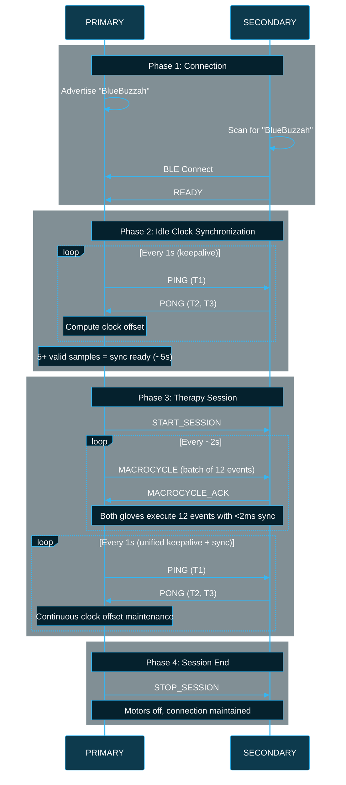
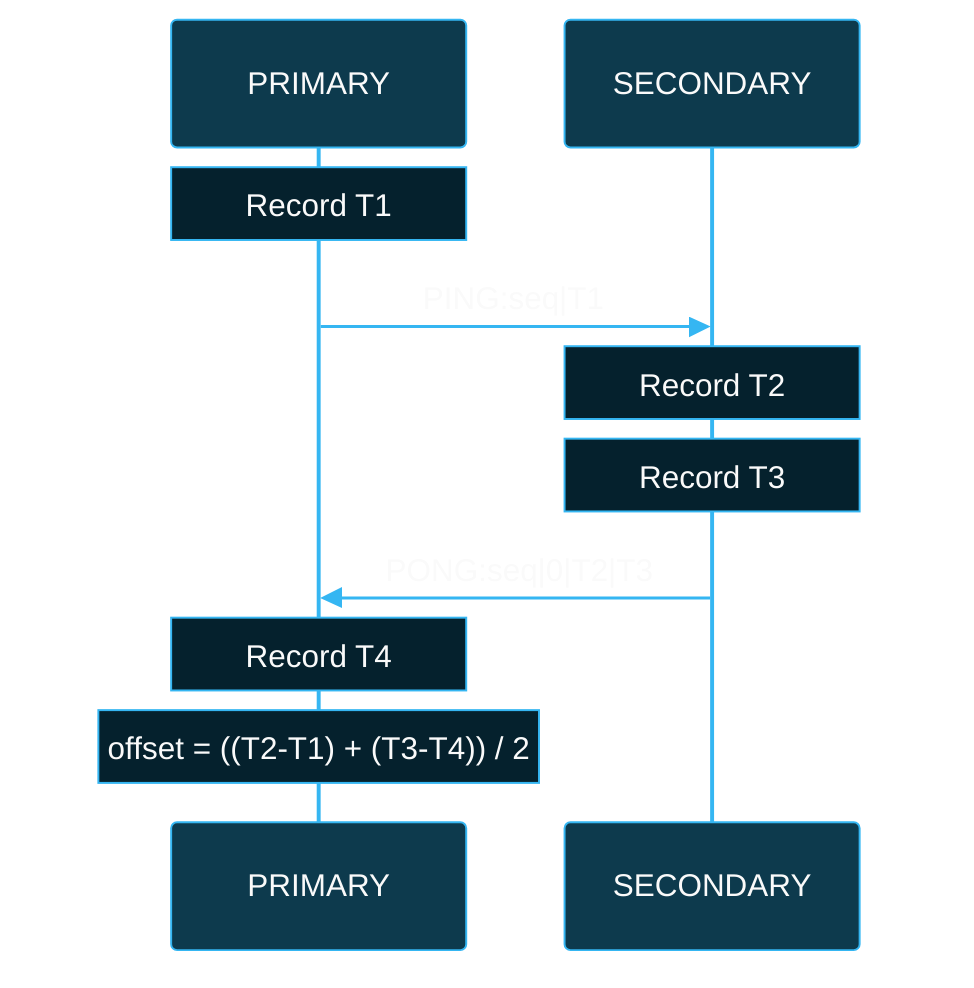
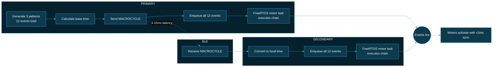
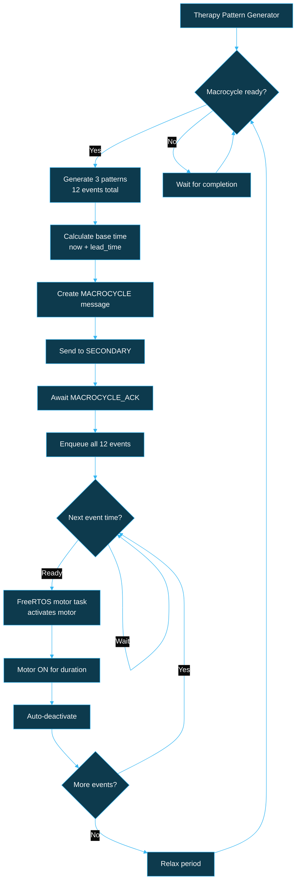
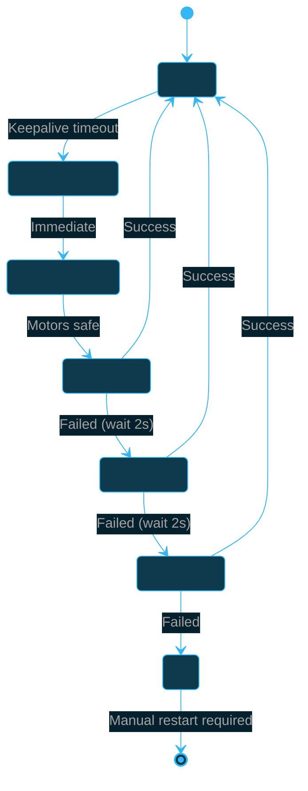

# BlueBuzzah Synchronization Protocol

**Version:** 2.5.0
**Last Updated:** 2026-01-18

---

## Overview

BlueBuzzah uses a bilateral synchronization protocol to coordinate haptic feedback between two gloves (PRIMARY and SECONDARY) over Bluetooth Low Energy. The protocol achieves <1ms synchronization accuracy using IEEE 1588 PTP-inspired clock synchronization with absolute time scheduling and microsecond-precision timestamps.

| Metric | Target | Achieved |
|--------|--------|----------|
| Bilateral sync accuracy | <50ms | <1ms |
| Clock offset precision | <5ms | <500µs |
| BLE latency compensation | Yes | PTP 4-timestamp |

### Core Principles

- **PRIMARY commands, SECONDARY follows** — All therapy decisions originate from PRIMARY
- **Absolute time scheduling** — Commands include future activation timestamps
- **Continuous synchronization** — Clock offset maintained throughout session
- **Fail-safe design** — SECONDARY halts if PRIMARY connection lost

---

## Session Lifecycle



### Timing Requirements

| Phase | Maximum Duration |
|-------|------------------|
| Connection establishment | 15 seconds |
| Initial clock sync | ~5 seconds (5 samples @ 1s interval) |
| Session start | Immediate after sync |
| Keepalive timeout | 6 seconds (6 missed) |

---

## Clock Synchronization

### PTP 4-Timestamp Exchange

The protocol uses IEEE 1588-inspired clock synchronization to measure the offset between PRIMARY and SECONDARY clocks, independent of network asymmetry.



### Offset Calculation

```text
offset = ((T2 - T1) + (T3 - T4)) / 2
```

| Timestamp | Device | Event |
|-----------|--------|-------|
| T1 | PRIMARY | PING sent |
| T2 | SECONDARY | PING received |
| T3 | SECONDARY | PONG sent |
| T4 | PRIMARY | PONG received |

A positive offset means SECONDARY's clock is ahead of PRIMARY.

### RTT Measurement

Round-Trip Time (RTT) is calculated using the IEEE 1588 PTP formula:

```text
RTT = (T4 - T1) - (T3 - T2)
```

This formula isolates network latency from SECONDARY processing time:
- `(T4 - T1)` = total round trip including processing
- `(T3 - T2)` = SECONDARY processing time
- Result = pure network latency (BLE transmission delays only)

Excluding processing time provides:
- More accurate network latency estimates (5-20ms typical)
- Better quality filtering (rejects poor BLE conditions, not slow processing)
- Improved lead time precision (adapts to actual network conditions)

### Filtering and Maintenance

- **Initial sync:** Idle keepalive (1s) accumulates samples, median offset selected
- **Quality filter:** Exchanges with RTT > 60ms are discarded (network latency only)
- **Minimum valid:** At least 5 good samples required (~5s after connect)
- **Drift compensation:** Ongoing sync every 1s corrects for crystal drift
- **Smoothing:** Exponential moving average prevents sudden jumps
- **Drift rate capping:** Dual caps for safety (see below)

### Outlier Rejection

The clock sync algorithm uses MAD (Median Absolute Deviation) to filter outliers before computing the final offset:

1. Compute preliminary median from all offset samples
2. Filter samples with deviation > 5ms from preliminary median
3. Compute final median from filtered samples only
4. Require minimum 5 valid samples after filtering

This improves robustness against BLE retransmissions and RF interference that cause anomalous RTT measurements.

### Drift Rate Caps (Dual)

The protocol uses **two separate drift rate caps** for safety:

| Cap | Value | Application | Purpose |
|-----|-------|-------------|---------|
| Measurement cap | ±150 ppm (0.15 µs/ms) | `updateDriftRate()` | Reject implausible measurements |
| Applied cap | ±100 ppm (0.10 µs/ms) | `getCorrectedOffset()`, `getProjectedOffset()` | Conservative correction limit |

**Why two caps?**

1. **Measurement cap (150 ppm):** Filters out measurements that exceed typical crystal drift (±20-50 ppm). A measurement of 150 ppm indicates BLE anomalies, not actual clock drift.

2. **Applied cap (100 ppm):** More conservative limit for actual corrections. Even if measured drift is valid, applying too large a correction can cause over-compensation and oscillation.

```cpp
// From config.h:
#define SYNC_MAX_DRIFT_RATE_US_PER_MS 0.15f       // Measurement cap (150 ppm)
#define SYNC_MAX_APPLIED_DRIFT_RATE_US_PER_MS 0.1f  // Applied cap (100 ppm)
```

Typical nRF52840 crystal drift is ±20-50 ppm. The 100 ppm applied cap provides ~2× headroom while preventing runaway drift compensation.

### Warm-Start Sync (Quick Reconnection)

Brief BLE disconnections (interference, range limits) can recover quickly using cached sync state:

| Scenario | Samples Required | Recovery Time |
|----------|------------------|---------------|
| Cold start (first connect) | 5 | ~5 seconds |
| Warm start (<15s disconnect) | 3 confirmatory | ~3 seconds |
| Long disconnect (>15s) | 5 | ~5 seconds |

**Warm-start process:**
1. On valid sync, cache current offset + drift rate (updated continuously)
2. On disconnect, cache preserved with timestamp
3. On reconnect within 15 seconds:
   - Project cached offset forward using drift rate
   - Enter warm-start mode
   - Require 3 confirmatory samples within 5ms of projection
4. If samples diverge >5ms, abort to cold start (safety fallback)

This reduces user-perceived disruption from 6-10+ seconds to ~3 seconds for brief BLE interference events.

---

## Synchronized Execution

### MACROCYCLE Command Flow



### Lead Time Calculation

The activation time is set in the future to ensure SECONDARY receives and processes the command before the scheduled time:

```text
activate_time = current_time + lead_time
lead_time = average_RTT + 3σ_variance + processing_overhead
```

| Parameter | Value | Purpose |
|-----------|-------|---------|
| Minimum lead time | 70ms | Covers RTT (~40ms) + variance (~5ms) + processing (20ms) + generation (5ms) |
| Maximum lead time | 150ms | Conservative upper bound for worst-case BLE conditions |
| Safety margin | 3× latency variance | Handles jitter |
| Processing overhead | 10ms | BLE callback + deserialization + queue forwarding |

### Time Conversion

SECONDARY converts PRIMARY timestamps to local time:

```text
local_time = primary_time + clock_offset
```

---

## Therapy Event Cycle



### Macrocycle Structure

One therapy macrocycle consists of 3 patterns (12 buzz events total) followed by a relax period:

| Component | Duration |
|-----------|----------|
| Motor ON time | 100ms (configurable) |
| Motor OFF time | 67ms (configurable) |
| Fingers per pattern | 4 |
| Patterns per macrocycle | 3 |
| Events per macrocycle | 12 (3 patterns × 4 fingers) |
| Pattern duration | ~668ms |
| Inter-macrocycle relax | ~1336ms (2× pattern duration) |
| **Total macrocycle** | **~3.3 seconds** |

### Macrocycle Batching Architecture

PRIMARY sends all 12 events in a single MACROCYCLE message. This batching approach provides:

- **~4× reduction in BLE traffic** (~200 bytes vs ~720 bytes)
- **Zero BLE during motor activity** — all commands sent before first buzz
- **Single clock offset application** — less computation, fewer rounding errors
- **Cleaner architecture** — macrocycle as atomic unit

SECONDARY's `ActivationQueue` schedules all 12 events with their local activation times, then processes them as time elapses.

---

## Error Handling

### Connection Loss Recovery



### Timeout Behavior

| Event | Timeout | Action |
|-------|---------|--------|
| No SECONDARY found | 15s | Abort startup |
| No READY received | 8s | Abort startup |
| No MACROCYCLE received | 10s | Emergency stop |
| No PING/PONG | 6s | Emergency stop + reconnect |

---

## Message Reference

### Message Format

All messages use the format:

```text
COMMAND:field1|field2|field3|...
```

- Field delimiter: `|` (pipe)
- Message terminator: `0x04` (EOT)
- Timestamps: Microseconds since boot

### Handshake Messages

| Message | Direction | Fields | Example |
|---------|-----------|--------|---------|
| `READY` | S → P | (none) | `READY` |
| `START_SESSION` | P → S | seq, timestamp | `START_SESSION:1\|50000` |
| `STOP_SESSION` | P → S | seq, timestamp | `STOP_SESSION:99\|120000000` |

### Synchronization Messages

| Message | Direction | Fields | Example |
|---------|-----------|--------|---------|
| `PING` | P → S | seq, T1 | `PING:42\|1000000` |
| `PONG` | S → P | seq, 0, T2, T3 | `PONG:42\|0\|1000500\|1000600` |

**Unified Keepalive + Clock Sync:**

The protocol uses a single unified mechanism for both keepalive and clock synchronization:

| State | Mechanism | Interval | Purpose |
|-------|-----------|----------|---------|
| All states | PING/PONG | 1 second | Clock sync + keepalive (unified) |

- **PING** provides: Clock sync timestamp (T1) + proof PRIMARY is alive
- **PONG** provides: Clock sync response (T2, T3) + proof SECONDARY is alive
- **Continuous sync:** Clock offset is maintained every second, even during therapy
- **No separate keepalive:** PING/PONG serves both purposes efficiently

This unified approach provides continuous clock synchronization (max 1s between samples) throughout all session states, eliminating clock drift during therapy.

### Therapy Messages

| Message | Direction | Fields | Example |
|---------|-----------|--------|---------|
| `MACROCYCLE` | P → S | seq, baseTime, count, events... | See below |
| `MACROCYCLE_ACK` | S → P | seq | `MC_ACK:42` |
| `DEACTIVATE` | P → S | seq, timestamp | `DEACTIVATE:43\|5100000` |

**MACROCYCLE format (V5):**

```text
MC:seq|baseHigh|baseLow|offHigh|offLow|dur|count|d,f,a[,fo]|d,f,a[,fo]|...
```

| Field | Description |
|-------|-------------|
| seq | Sequence number for ACK matching |
| baseHigh | High 32 bits of baseTime (µs) |
| baseLow | Low 32 bits of baseTime (µs) |
| offHigh | High 32 bits of clockOffset (signed) |
| offLow | Low 32 bits of clockOffset |
| dur | Common ON duration for all events (ms) |
| count | Number of events (typically 12: 3 patterns × 4 fingers) |
| d | Delta time from baseTime (ms) |
| f | Finger index (0-3) |
| a | Amplitude percentage (0-100) |
| fo | Frequency offset (optional): `(freq - 200) / 5` for 200-455 Hz range |

**Example MACROCYCLE:**

```text
MC:1|0|5050000|0|12345|100|12|0,0,100|167,1,100|334,2,100|...
```

**Note:** The V5 format preserves full microsecond precision for baseTime by splitting the 64-bit value into two 32-bit parts, avoiding the up to 999µs precision loss in the previous millisecond-based format.

SECONDARY applies clock offset once to baseTime, then schedules all 12 events via an activation queue. This reduces BLE traffic from 12 messages to 1 per macrocycle (~200 bytes vs ~720 bytes).

### Parameter Messages

| Message | Direction | Fields | Example |
|---------|-----------|--------|---------|
| `PARAM_UPDATE` | P → S | key:value pairs | `PARAM_UPDATE:TIME_ON:150:JITTER:10` |
| `SEED` | P → S | random seed | `SEED:123456` |
| `SEED_ACK` | S → P | (none) | `SEED_ACK` |

### Status Messages

| Message | Direction | Fields | Example |
|---------|-----------|--------|---------|
| `GET_BATTERY` | P → S | (none) | `GET_BATTERY` |
| `BAT_RESPONSE` | S → P | voltage | `BAT_RESPONSE:3.68` |

---

## Safety Validations

The protocol includes several safety mechanisms to prevent incorrect synchronization:

| Validation | Threshold | Action |
|------------|-----------|--------|
| Offset magnitude | ±35 seconds | Reject samples with unreasonable clock drift |
| baseTime freshness | ±30 seconds | Reject macrocycles with stale timestamps |
| Drift rate (measured) | ±150 ppm | Cap measured drift for plausibility |
| Drift rate (applied) | ±100 ppm | Cap corrections to prevent oscillation |
| Elapsed time | 10 seconds max | Cap EMA time delta to prevent overflow |
| RTT quality | 60ms | Reject samples affected by retransmissions |

These validations ensure that BLE interference or momentary disconnects don't cause the sync system to make large erroneous corrections.

---

## Tuning Guidance

### RTT Quality Threshold

The `SYNC_RTT_QUALITY_THRESHOLD_US` (60ms) balances sample acceptance vs quality:
- **Too low (20ms):** Rejects most samples, slow sync convergence
- **Too high (200ms):** Accepts retransmission-affected samples, poor accuracy
- **Recommended:** 60ms rejects ~10-20% of samples while maintaining <1ms accuracy

### Connection Interval Trade-offs

| Interval | Latency | Battery | Use Case |
|----------|---------|---------|----------|
| 7.5ms | Lowest | Highest drain | Active therapy |
| 15ms | Medium | Medium drain | Idle monitoring |
| 30ms | Higher | Lower drain | Background connection |

Current setting: 7.5-10ms for maximum sync accuracy during therapy.

### Outlier Threshold

The outlier rejection uses MAD (Median Absolute Deviation) with minimum 5ms:
- **Automatic:** Adapts to network conditions (3× MAD)
- **Minimum floor:** Never rejects samples within 5ms of median
- **Aggressive mode:** Reduce floor to 3ms if network is very stable

---

## Known Limitations

### SECONDARY Stateless Design

The SECONDARY glove operates statelessly—it receives macrocycles with clock offset but doesn't send timing feedback. This simplifies the protocol but means:
- PRIMARY cannot detect SECONDARY clock drift directly
- Sync quality relies entirely on PING/PONG exchanges
- If PING/PONG fails, sync degrades silently

### Timestamp Precision

- `micros()` on nRF52840 has ~1µs resolution
- `micros()` overflows at ~71 minutes (32-bit wraparound)
- `getMicros()` wrapper detects and handles overflow using 64-bit counters
- Maximum uptime before overflow issues: ~584 years (64-bit)

### Interrupt Safety

Sync state variables are accessed from both main loop and BLE callbacks. Key considerations:
- Connection state marked `volatile` for cache coherency
- Sequence ID generator is NOT thread-safe (main loop only)
- Large structures (Macrocycle) should only be modified from main loop

### ARM printf Limitations

- 64-bit printf (%llu, %lld) not supported on ARM Cortex-M4
- Macrocycle serialization splits 64-bit values into high/low 32-bit parts
- This adds ~10 bytes overhead per macrocycle but ensures portability

---

## Protocol Parameters

| Parameter | Value | Description |
|-----------|-------|-------------|
| RTT quality threshold | 60ms | Discard samples with higher RTT |
| Minimum valid samples | 5 | Required for valid sync (~5s from connect) |
| Outlier threshold | 5ms | Offset outlier rejection (MAD-based filtering) |
| PING/PONG interval | 1s | Unified keepalive + clock sync (all states) |
| Keepalive timeout (SECONDARY) | 6s | 6 missed PINGs = connection lost |
| Keepalive timeout (PRIMARY) | 4s | During therapy (emergency shutdown) |
| MACROCYCLE timeout | 10s | SECONDARY safety halt |
| Lead time range | 70-150ms | Adaptive scheduling window |
| Initial lead time | 35ms (clamped to 70ms) | Base value before RTT samples, clamped to min |
| Processing overhead | 10ms | SECONDARY processing time allowance |
| Max drift rate (measurement) | ±150 ppm | Measurement cap for plausibility |
| Max drift rate (applied) | ±100 ppm | Conservative correction limit |
| Warm-start validity | 15s | Cache valid after disconnect |
| BLE connection interval | 7.5-10ms | Low-latency communication (6-8 BLE units) |

---

## See Also

- **[BLE_PROTOCOL.md](BLE_PROTOCOL.md)** — Phone app command protocol
- **[THERAPY_ENGINE.md](THERAPY_ENGINE.md)** — Pattern generation
- **[ARCHITECTURE.md](ARCHITECTURE.md)** — System design overview
