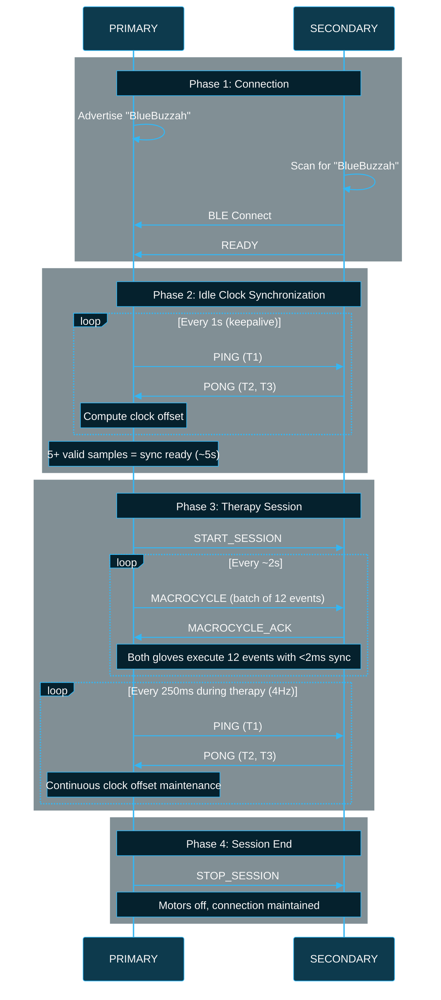
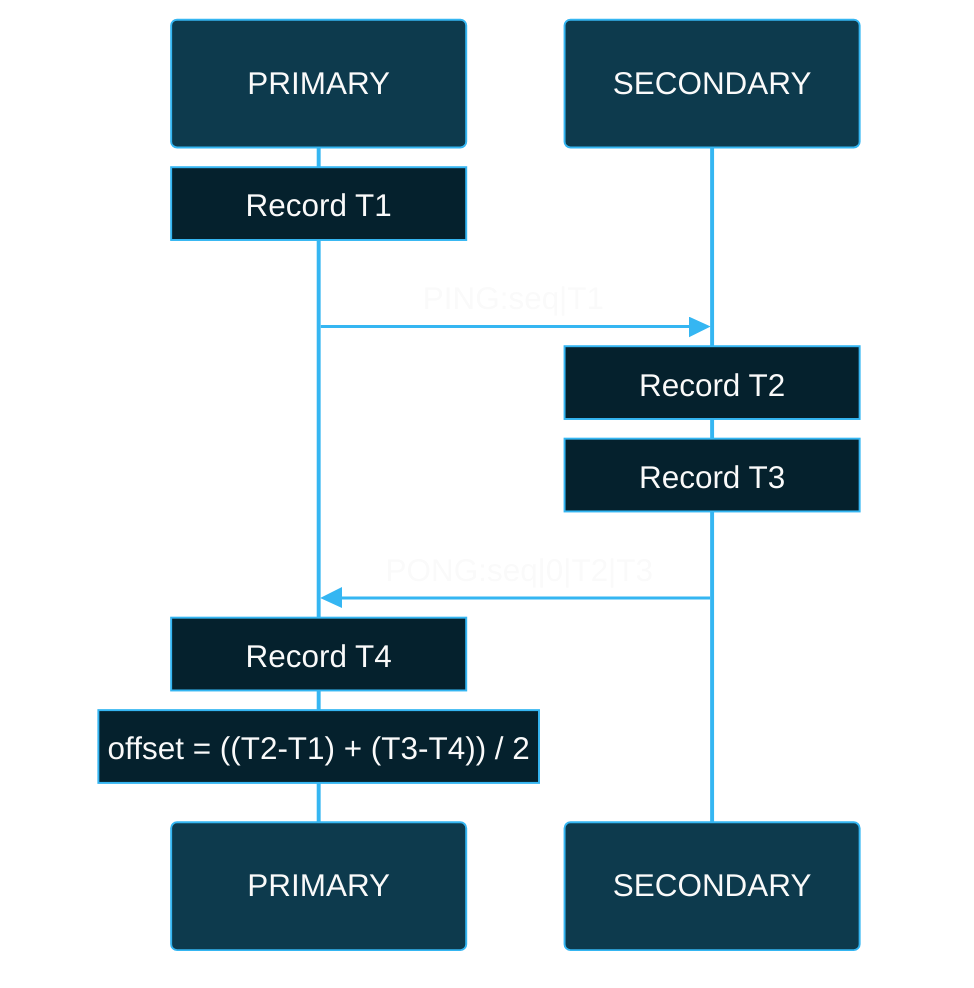
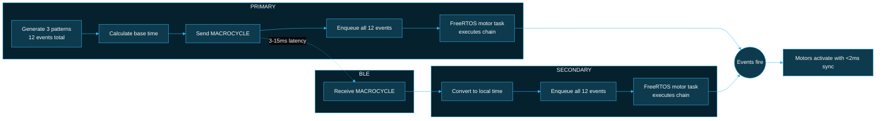
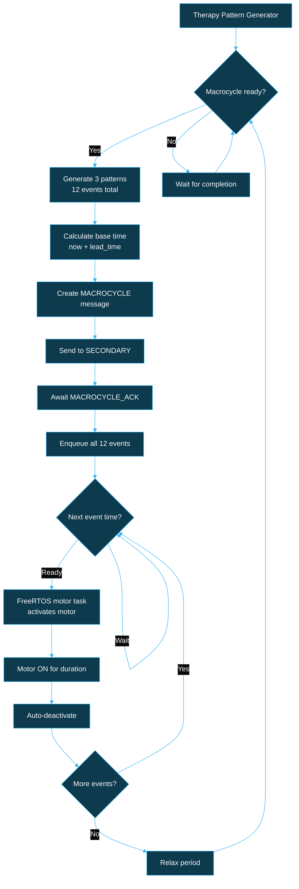
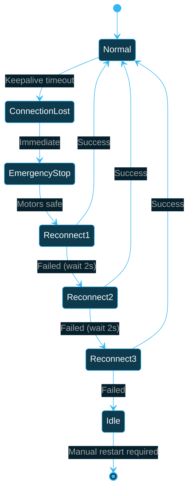

# BlueBuzzah Synchronization Protocol

**Version:** 2.6.0
**Last Updated:** 2026-06-10

---

## Overview

BlueBuzzah uses a bilateral synchronization protocol to coordinate haptic feedback between two gloves (PRIMARY and SECONDARY) over Bluetooth Low Energy. The protocol achieves <1ms synchronization accuracy using IEEE 1588 PTP-inspired clock synchronization with absolute time scheduling and microsecond-precision timestamps.

| Metric | Target | Achieved |
|--------|--------|----------|
| Bilateral sync accuracy | <50ms | pending re-validation (see SYNC_VALIDATION.md) |
| Clock offset precision | <5ms | pending re-validation (see SYNC_VALIDATION.md) |
| BLE latency compensation | Yes | PTP 4-timestamp |

> **Note on previous figures:** The "<1ms" and "<500µs" values cited in earlier revisions were measured against the FreeRTOS tick clock, which has ~976µs quantization because DWT was never enabled. Those numbers reflect tick-quantized timestamps, not true sub-millisecond resolution. The system is being re-baselined on the 1MHz hardware timebase introduced in this revision; see SYNC_VALIDATION.md for acceptance gates.

### Core Principles

- **PRIMARY commands, SECONDARY follows** — All therapy decisions originate from PRIMARY
- **Absolute time scheduling** — Commands include future activation timestamps
- **Continuous synchronization** — Clock offset maintained throughout session
- **Fail-safe design** — SECONDARY halts if PRIMARY connection lost

---

## Session Lifecycle


```mermaid
%%{init: {'theme': 'base', 'themeVariables': {
  'primaryColor': '#0d3a4d',
  'primaryTextColor': '#fafafa',
  'primaryBorderColor': '#35B6F2',
  'lineColor': '#35B6F2',
  'secondaryColor': '#05212D',
  'tertiaryColor': '#0a0a0a',
  'background': '#0a0a0a',
  'actorBkg': '#0d3a4d',
  'actorBorder': '#35B6F2',
  'actorTextColor': '#fafafa',
  'actorLineColor': '#35B6F2',
  'signalColor': '#35B6F2',
  'signalTextColor': '#fafafa',
  'labelBoxBkgColor': '#05212D',
  'labelBoxBorderColor': '#35B6F2',
  'labelTextColor': '#fafafa',
  'loopTextColor': '#fafafa',
  'noteBkgColor': '#05212D',
  'noteBorderColor': '#35B6F2',
  'noteTextColor': '#fafafa',
  'activationBkgColor': '#0d3a4d',
  'activationBorderColor': '#35B6F2',
  'sequenceNumberColor': '#fafafa'
}}}%%
sequenceDiagram
    participant P as PRIMARY
    participant S as SECONDARY

    rect rgba(5, 33, 45, 0.5)
        Note over P,S: Phase 1: Connection
        P->>P: Advertise "BlueBuzzah"
        S->>S: Scan for "BlueBuzzah"
        S->>P: BLE Connect
        S->>P: READY
    end

    rect rgba(5, 33, 45, 0.5)
        Note over P,S: Phase 2: Idle Clock Synchronization
        loop Every 1s (keepalive)
            P->>S: PING (T1)
            S->>P: PONG (T2, T3)
            Note over P: Compute clock offset
        end
        Note over P: 5+ valid samples = sync ready (~5s)
    end

    rect rgba(5, 33, 45, 0.5)
        Note over P,S: Phase 3: Therapy Session
        P->>S: START_SESSION
        loop Every ~2s
            P->>S: MACROCYCLE (batch of 12 events)
            S->>P: MACROCYCLE_ACK
            Note over P,S: Both gloves execute 12 events with <2ms sync
        end
        loop Every 250ms during therapy (4Hz)
            P->>S: PING (T1)
            S->>P: PONG (T2, T3)
            Note over P: Continuous clock offset maintenance
        end
    end

    rect rgba(5, 33, 45, 0.5)
        Note over P,S: Phase 4: Session End
        P->>S: STOP_SESSION
        Note over P,S: Motors off, connection maintained
    end
```

### Timing Requirements

| Phase | Maximum Duration |
|-------|------------------|
| Connection establishment | 15 seconds |
| Initial clock sync | ~5 seconds (5 samples @ 1s interval) |
| Session start | Immediate after sync |
| Keepalive timeout | 6 seconds (6 missed) |

---

## Clock Synchronization

### PTP 4-Timestamp Exchange

The protocol uses IEEE 1588-inspired clock synchronization to measure the offset between PRIMARY and SECONDARY clocks, independent of network asymmetry.


```mermaid
%%{init: {'theme': 'base', 'themeVariables': {
  'primaryColor': '#0d3a4d',
  'primaryTextColor': '#fafafa',
  'primaryBorderColor': '#35B6F2',
  'lineColor': '#35B6F2',
  'secondaryColor': '#05212D',
  'tertiaryColor': '#0a0a0a',
  'background': '#0a0a0a',
  'actorBkg': '#0d3a4d',
  'actorBorder': '#35B6F2',
  'actorTextColor': '#fafafa',
  'actorLineColor': '#35B6F2',
  'signalColor': '#35B6F2',
  'signalTextColor': '#fafafa',
  'labelBoxBkgColor': '#05212D',
  'labelBoxBorderColor': '#35B6F2',
  'labelTextColor': '#fafafa',
  'loopTextColor': '#fafafa',
  'noteBkgColor': '#05212D',
  'noteBorderColor': '#35B6F2',
  'noteTextColor': '#fafafa',
  'activationBkgColor': '#0d3a4d',
  'activationBorderColor': '#35B6F2',
  'sequenceNumberColor': '#fafafa'
}}}%%
sequenceDiagram
    participant P as PRIMARY
    participant S as SECONDARY

    Note over P: Record T1
    P->>S: PING:seq|T1
    Note over S: Record T2

    Note over S: Record T3
    S->>P: PONG:seq|0|T2|T3
    Note over P: Record T4

    Note over P: offset = ((T2-T1) + (T3-T4)) / 2
```

### Offset Calculation

```text
offset = ((T2 - T1) + (T3 - T4)) / 2
```

| Timestamp | Device | Event |
|-----------|--------|-------|
| T1 | PRIMARY | PING sent |
| T2 | SECONDARY | PING received |
| T3 | SECONDARY | PONG sent |
| T4 | PRIMARY | PONG received |

A positive offset means SECONDARY's clock is ahead of PRIMARY.

### RTT Measurement

Round-Trip Time (RTT) is calculated using the IEEE 1588 PTP formula:

```text
RTT = (T4 - T1) - (T3 - T2)
```

This formula isolates network latency from SECONDARY processing time:
- `(T4 - T1)` = total round trip including processing
- `(T3 - T2)` = SECONDARY processing time
- Result = pure network latency (BLE transmission delays only)

Excluding processing time provides:
- More accurate network latency estimates (5-20ms typical)
- Better quality filtering (rejects poor BLE conditions, not slow processing)
- Improved lead time precision (adapts to actual network conditions)

### Transmit Timestamping

T1 (PING sent) and T3 (PONG sent) are stamped at **SoftDevice handoff** rather than at message creation. Both PING and PONG are enqueued as deferred-stamp TX entries; the timestamp is filled by the `onTxStamped` callback inside `processTxQueue` at the moment the BLE stack accepts the packet for transmission.

**Why this matters:** Between message construction and the BLE radio actually picking up a packet, the main loop may run other work (sensor reads, state-machine ticks, motor-queue processing). Stamping at creation captures that variable queuing delay as apparent propagation time, introducing an asymmetric bias into PTP offset samples. Stamping at handoff removes that latency from the measurement.

`onTxStamped` records `pingT1` and `pingSeq` for PING packets so the offset calculation can correlate the correct T1 with the matching PONG response.

**PONG sequence matching:** The PONG handler validates that the received sequence number matches the in-flight `pingSeq`. A sequence-mismatched (stale) PONG is discarded without clearing in-flight state or consuming the keepalive credit, preventing stale replies from poisoning offset samples or triggering a false keepalive timeout.

### Filtering and Maintenance

- **Initial sync:** Idle keepalive (1s) accumulates samples, median offset selected
- **Minimum valid:** At least 5 good samples required (~5s after connect)
- **Drift compensation:** Ongoing sync at 4Hz during therapy / 1Hz idle corrects for crystal drift
- **Smoothing:** Exponential moving average prevents sudden jumps
- **Drift rate capping:** Dual caps for safety (see below)

#### Maintenance Sample Quality Gates

Three gates are applied in order before a maintenance sample updates the EMA:

1. **RTT hard ceiling (60ms):** Any exchange with RTT > 60ms is discarded. This rejects samples polluted by BLE retransmissions where the network path is too lossy to yield a reliable offset.

2. **Lucky-packet gate (decaying minimum RTT):** A tracked per-session minimum RTT (`minRTT`) is maintained and decays upward by `SYNC_MIN_RTT_DECAY_US` (200µs) per sample to allow gradual adaptation. Only exchanges with `RTT <= minRTT + SYNC_LUCKY_RTT_MARGIN_US` (10ms) are accepted. This gate selects low-jitter "lucky" packets whose round-trip approximates the true one-way propagation time, providing better offset estimates.

3. **Innovation gate with hard re-anchor on persistence:** If a candidate offset deviates from the current EMA by more than `SYNC_INNOVATION_GATE_US` (5ms) it is initially rejected. If the same direction of deviation persists across `SYNC_INNOVATION_REJECT_LIMIT` (5) consecutive samples, the protocol interprets this as a true step change (e.g., from a long disconnect or oscillator retrim) and **hard re-anchors** the offset to the new value rather than blending it in via EMA. This prevents the EMA from chasing transient noise while still tracking genuine clock jumps.

#### Dedicated Drift-Measurement Anchor

Drift rate is measured over wall-time windows of at least `SYNC_MIN_DRIFT_INTERVAL_MS` (500ms) using a dedicated anchor pair (`_driftAnchorOffset` / `_driftAnchorTime`). This is separate from the EMA update path, so the 4Hz sync cadence during therapy does not stall drift estimation by providing too-short intervals.

### Outlier Rejection

The clock sync algorithm uses MAD (Median Absolute Deviation) to filter outliers before computing the final offset:

1. Compute preliminary median from all offset samples
2. Filter samples with deviation > 5ms from preliminary median
3. Compute final median from filtered samples only
4. Require minimum 5 valid samples after filtering

This improves robustness against BLE retransmissions and RF interference that cause anomalous RTT measurements.

### Drift Rate Caps (Dual)

The protocol uses **two separate drift rate caps** for safety:

| Cap | Value | Application | Purpose |
|-----|-------|-------------|---------|
| Measurement cap | ±150 ppm (0.15 µs/ms) | `updateDriftRate()` | Reject implausible measurements |
| Applied cap | ±100 ppm (0.10 µs/ms) | `getCorrectedOffset()`, `getProjectedOffset()` | Conservative correction limit |

**Why two caps?**

1. **Measurement cap (150 ppm):** Filters out measurements that exceed typical crystal drift (±20-50 ppm). A measurement of 150 ppm indicates BLE anomalies, not actual clock drift.

2. **Applied cap (100 ppm):** More conservative limit for actual corrections. Even if measured drift is valid, applying too large a correction can cause over-compensation and oscillation.

```cpp
// From config.h:
#define SYNC_MAX_DRIFT_RATE_US_PER_MS 0.15f       // Measurement cap (150 ppm)
#define SYNC_MAX_APPLIED_DRIFT_RATE_US_PER_MS 0.1f  // Applied cap (100 ppm)
```

Typical nRF52840 crystal drift is ±20-50 ppm. The 100 ppm applied cap provides ~2× headroom while preventing runaway drift compensation.

### Warm-Start Sync (Quick Reconnection)

Brief BLE disconnections (interference, range limits) can recover quickly using cached sync state:

| Scenario | Samples Required | Recovery Time |
|----------|------------------|---------------|
| Cold start (first connect) | 5 | ~5 seconds |
| Warm start (<15s disconnect) | 3 confirmatory | ~3 seconds |
| Long disconnect (>15s) | 5 | ~5 seconds |

**Warm-start process:**
1. On valid sync, cache current offset + drift rate (updated continuously)
2. On disconnect, cache preserved with timestamp
3. On reconnect within 15 seconds:
   - Project cached offset forward using drift rate
   - Enter warm-start mode
   - Require 3 confirmatory samples within 5ms of projection
4. If samples diverge >5ms, abort to cold start (safety fallback)

This reduces user-perceived disruption from 6-10+ seconds to ~3 seconds for brief BLE interference events.

---

## Synchronized Execution

### MACROCYCLE Command Flow


```mermaid
%%{init: {'theme': 'base', 'themeVariables': {
  'primaryColor': '#0d3a4d',
  'primaryTextColor': '#fafafa',
  'primaryBorderColor': '#35B6F2',
  'lineColor': '#35B6F2',
  'secondaryColor': '#05212D',
  'tertiaryColor': '#0a0a0a',
  'background': '#0a0a0a',
  'mainBkg': '#0d3a4d',
  'nodeBorder': '#35B6F2',
  'clusterBkg': '#05212D',
  'clusterBorder': '#35B6F2',
  'titleColor': '#fafafa',
  'edgeLabelBackground': '#0a0a0a'
}}}%%
flowchart LR
    subgraph PRIMARY
        A[Generate 3 patterns<br/>12 events total] --> B[Calculate base time]
        B --> C[Send MACROCYCLE]
        C --> D[Enqueue all 12 events]
        D --> E[FreeRTOS motor task<br/>executes chain]
    end

    subgraph BLE
        C -.->|3-15ms latency| F
    end

    subgraph SECONDARY
        F[Receive MACROCYCLE] --> G[Convert to local time]
        G --> H[Enqueue all 12 events]
        H --> I[FreeRTOS motor task<br/>executes chain]
    end

    E --> J((Events fire))
    I --> J
    J --> K[Motors activate with <2ms sync]
```

### Lead Time Calculation

The activation time is set in the future to ensure SECONDARY receives and processes the command before the scheduled time:

```text
activate_time = current_time + lead_time
lead_time = average_RTT + 3σ_variance + processing_overhead
```

| Parameter | Value | Purpose |
|-----------|-------|---------|
| Minimum lead time | 70ms | Covers RTT (~40ms) + variance (~5ms) + processing (20ms) + generation (5ms) |
| Maximum lead time | 150ms | Conservative upper bound for worst-case BLE conditions |
| Safety margin | 3× latency variance | Handles jitter |
| Processing overhead | 10ms | BLE callback + deserialization + queue forwarding |

### Time Conversion

SECONDARY converts PRIMARY timestamps to local time:

```text
local_time = primary_time + clock_offset
```

---

## Therapy Event Cycle


```mermaid
%%{init: {'theme': 'base', 'themeVariables': {
  'primaryColor': '#0d3a4d',
  'primaryTextColor': '#fafafa',
  'primaryBorderColor': '#35B6F2',
  'lineColor': '#35B6F2',
  'secondaryColor': '#05212D',
  'tertiaryColor': '#0a0a0a',
  'background': '#0a0a0a',
  'mainBkg': '#0d3a4d',
  'nodeBorder': '#35B6F2',
  'clusterBkg': '#05212D',
  'clusterBorder': '#35B6F2',
  'titleColor': '#fafafa',
  'edgeLabelBackground': '#0a0a0a'
}}}%%
flowchart TD
    A[Therapy Pattern Generator] --> B{Macrocycle ready?}
    B -->|Yes| C[Generate 3 patterns<br/>12 events total]
    B -->|No| D[Wait for completion]
    D --> B

    C --> E[Calculate base time<br/>now + lead_time]
    E --> F[Create MACROCYCLE message]
    F --> G[Send to SECONDARY]
    G --> H[Await MACROCYCLE_ACK]
    H --> I[Enqueue all 12 events]

    I --> J{Next event time?}
    J -->|Wait| J
    J -->|Ready| K[FreeRTOS motor task<br/>activates motor]
    K --> L[Motor ON for duration]
    L --> M[Auto-deactivate]
    M --> N{More events?}
    N -->|Yes| J
    N -->|No| O[Relax period]
    O --> B
```

### Macrocycle Structure

One therapy macrocycle consists of 3 patterns (12 buzz events total) followed by a relax period:

| Component | Duration |
|-----------|----------|
| Motor ON time | 100ms (configurable) |
| Motor OFF time | 67ms (configurable) |
| Fingers per pattern | 4 |
| Patterns per macrocycle | 3 |
| Events per macrocycle | 12 (3 patterns × 4 fingers) |
| Pattern duration | ~668ms |
| Inter-macrocycle relax | ~1336ms (2× pattern duration) |
| **Total macrocycle** | **~3.3 seconds** |

### Macrocycle Batching Architecture

PRIMARY sends all 12 events in a single MACROCYCLE message. This batching approach provides:

- **~4× reduction in BLE traffic** (~200 bytes vs ~720 bytes)
- **Zero BLE during motor activity** — all commands sent before first buzz
- **Single clock offset application** — less computation, fewer rounding errors
- **Cleaner architecture** — macrocycle as atomic unit

SECONDARY's `ActivationQueue` schedules all 12 events with their local activation times, then processes them as time elapses.

---

## Error Handling

### Connection Loss Recovery


```mermaid
%%{init: {'theme': 'base', 'themeVariables': {
  'primaryColor': '#0d3a4d',
  'primaryTextColor': '#fafafa',
  'primaryBorderColor': '#35B6F2',
  'lineColor': '#35B6F2',
  'secondaryColor': '#05212D',
  'tertiaryColor': '#0a0a0a',
  'background': '#0a0a0a',
  'labelTextColor': '#fafafa',
  'stateBkg': '#0d3a4d',
  'stateBorder': '#35B6F2',
  'stateLabelColor': '#fafafa',
  'compositeBackground': '#05212D',
  'compositeBorder': '#35B6F2',
  'compositeTitleBackground': '#0d3a4d',
  'transitionColor': '#35B6F2',
  'transitionLabelColor': '#a3a3a3',
  'noteBkgColor': '#05212D',
  'noteBorderColor': '#35B6F2',
  'noteTextColor': '#fafafa'
}}}%%
stateDiagram-v2
    [*] --> Normal

    Normal --> ConnectionLost: Keepalive timeout

    ConnectionLost --> EmergencyStop: Immediate
    EmergencyStop --> Reconnect1: Motors safe

    Reconnect1 --> Normal: Success
    Reconnect1 --> Reconnect2: Failed (wait 2s)

    Reconnect2 --> Normal: Success
    Reconnect2 --> Reconnect3: Failed (wait 2s)

    Reconnect3 --> Normal: Success
    Reconnect3 --> Idle: Failed

    Idle --> [*]: Manual restart required
```

### Timeout Behavior

| Event | Timeout | Action |
|-------|---------|--------|
| No SECONDARY found | 15s | Abort startup |
| No READY received | 8s | Abort startup |
| No MACROCYCLE received | 10s | Emergency stop |
| No PING/PONG | 6s | Emergency stop + reconnect |

---

## Message Reference

### Message Format

All messages use the format:

```text
COMMAND:field1|field2|field3|...
```

- Field delimiter: `|` (pipe)
- Message terminator: `0x04` (EOT)
- Timestamps: Microseconds since boot

### Handshake Messages

| Message | Direction | Fields | Example |
|---------|-----------|--------|---------|
| `READY` | S → P | (none) | `READY` |
| `START_SESSION` | P → S | seq, timestamp | `START_SESSION:1\|50000` |
| `STOP_SESSION` | P → S | seq, timestamp | `STOP_SESSION:99\|120000000` |

### Synchronization Messages

| Message | Direction | Fields | Example |
|---------|-----------|--------|---------|
| `PING` | P → S | seq, T1 | `PING:42\|1000000` |
| `PONG` (legacy) | S → P | seq, 0, T2, T3 | `PONG:42\|0\|1000500\|1000600` |
| `PONG` (anchor) | S → P | seq, 0, T2High, T2Low, T3High, T3Low, AnchorHigh, AnchorLow — *see anchor section* | `PONG:42\|0\|0\|1000500\|0\|1000600\|0\|999800` |

PONG has two wire forms; see [Connection-Anchor Timestamping](#connection-anchor-timestamping-experimental) for the 6-field format and detection rules. When anchor timestamping is disabled (default), only the legacy 4-field form is used.

**Unified Keepalive + Clock Sync:**

The protocol uses a single unified mechanism for both keepalive and clock synchronization:

| State | Mechanism | Interval | Purpose |
|-------|-----------|----------|---------|
| Idle / no session | PING/PONG | 1 second | Clock sync + keepalive (unified) |
| Therapy active | PING/PONG | 250ms (4Hz) | Higher-cadence sync during therapy |

- **PING** provides: Clock sync timestamp (T1) + proof PRIMARY is alive
- **PONG** provides: Clock sync response (T2, T3) + proof SECONDARY is alive
- **Continuous sync:** Clock offset is maintained throughout all states
- **No separate keepalive:** PING/PONG serves both purposes efficiently

This unified approach provides continuous clock synchronization throughout all session states. The increased 4Hz cadence during therapy reduces the maximum interval between offset updates from 1s to 250ms, improving drift-compensation responsiveness.

### Therapy Messages

| Message | Direction | Fields | Example |
|---------|-----------|--------|---------|
| `MACROCYCLE` | P → S | seq, baseTime, count, events... | See below |
| `MACROCYCLE_ACK` | S → P | seq | `MC_ACK:42` |
| `DEACTIVATE` | P → S | seq, timestamp | `DEACTIVATE:43\|5100000` |

**MACROCYCLE format (V5):**

```text
MC:seq|baseHigh|baseLow|offHigh|offLow|dur|count|d,f,a[,fo]|d,f,a[,fo]|...
```

| Field | Description |
|-------|-------------|
| seq | Sequence number for ACK matching |
| baseHigh | High 32 bits of baseTime (µs) |
| baseLow | Low 32 bits of baseTime (µs) |
| offHigh | High 32 bits of clockOffset (signed) |
| offLow | Low 32 bits of clockOffset |
| dur | Common ON duration for all events (ms) |
| count | Number of events (typically 12: 3 patterns × 4 fingers) |
| d | Delta time from baseTime (ms) |
| f | Finger index (0-3) |
| a | Amplitude percentage (0-100) |
| fo | Frequency offset (optional): `(freq - 200) / 5` for 200-455 Hz range |

**Example MACROCYCLE:**

```text
MC:1|0|5050000|0|12345|100|12|0,0,100|167,1,100|334,2,100|...
```

**Note:** The V5 format preserves full microsecond precision for baseTime by splitting the 64-bit value into two 32-bit parts, avoiding the up to 999µs precision loss in the previous millisecond-based format.

SECONDARY applies clock offset once to baseTime, then schedules all 12 events via an activation queue. This reduces BLE traffic from 12 messages to 1 per macrocycle (~200 bytes vs ~720 bytes).

### Parameter Messages

| Message | Direction | Fields | Example |
|---------|-----------|--------|---------|
| `PARAM_UPDATE` | P → S | key:value pairs | `PARAM_UPDATE:TIME_ON:150:JITTER:10` |
| `SEED` | P → S | random seed | `SEED:123456` |
| `SEED_ACK` | S → P | (none) | `SEED_ACK` |

### Status Messages

| Message | Direction | Fields | Example |
|---------|-----------|--------|---------|
| `GET_BATTERY` | P → S | (none) | `GET_BATTERY` |
| `BATRESPONSE` | S → P | voltage | `BATRESPONSE:3.68` |

---

## Safety Validations

The protocol includes several safety mechanisms to prevent incorrect synchronization:

| Validation | Threshold | Action |
|------------|-----------|--------|
| Offset magnitude | ±35 seconds | Reject samples with unreasonable clock drift |
| baseTime freshness | ±30 seconds | Reject macrocycles with stale timestamps |
| Drift rate (measured) | ±150 ppm | Cap measured drift for plausibility |
| Drift rate (applied) | ±100 ppm | Cap corrections to prevent oscillation |
| Elapsed time | 10 seconds max | Cap EMA time delta to prevent overflow |
| RTT quality | 60ms | Reject samples affected by retransmissions |

These validations ensure that BLE interference or momentary disconnects don't cause the sync system to make large erroneous corrections.

---

## Tuning Guidance

### RTT Quality Threshold

The `SYNC_RTT_QUALITY_THRESHOLD_US` (60ms) balances sample acceptance vs quality:
- **Too low (20ms):** Rejects most samples, slow sync convergence
- **Too high (200ms):** Accepts retransmission-affected samples, poor accuracy
- **Recommended:** 60ms rejects ~10-20% of samples while maintaining <1ms accuracy

### Connection Interval Trade-offs

| Interval | Latency | Battery | Use Case |
|----------|---------|---------|----------|
| 7.5ms | Lowest | Highest drain | Active therapy |
| 15ms | Medium | Medium drain | Idle monitoring |
| 30ms | Higher | Lower drain | Background connection |

Current setting: 7.5-10ms for maximum sync accuracy during therapy.

### Outlier Threshold

The outlier rejection uses MAD (Median Absolute Deviation) with minimum 5ms:
- **Automatic:** Adapts to network conditions (3× MAD)
- **Minimum floor:** Never rejects samples within 5ms of median
- **Aggressive mode:** Reduce floor to 3ms if network is very stable

---

## Connection-Anchor Timestamping (Experimental)

> **Status:** Off by default (`SYNC_ANCHOR_TIMESTAMPING_ENABLED 0`). Both gloves must be built with the same flag value; mismatched builds will produce incompatible PONG wire formats.

### Motivation

Standard PTP offset estimation averages out asymmetric BLE path delays. When the SoftDevice schedules the radio connection event at a predictable wall-clock instant on both devices, each glove can record an independent "anchor" timestamp of that event and use the difference as a direct physical clock comparison — bypassing the asymmetry problem entirely.

### Radio Notification Anchors

A radio-notification ISR (SWI1, priority 2) fires approximately 800µs before each connection event. The ISR records the local `getMicros()` value into a 16-slot ring buffer (`SYNC_ANCHOR_RING_SIZE`). Because the SoftDevice schedules connection events at the same wall-clock instant on both ends of a link, the difference between PRIMARY's anchor and SECONDARY's anchor is a direct measure of clock offset without any assumption about path symmetry.

### 6-Field PONG Wire Format

When anchor timestamping is enabled, SECONDARY attaches its most recent rx anchor to the PONG reply using the extended wire format created by `createPongWithAnchor`:

| Field index | Name | Description |
|-------------|------|-------------|
| 0 | seq | Sequence number (matches PING) |
| 1 | reserved | Always 0 |
| 2 | T2High | High 32 bits of T2 (PING rx timestamp) |
| 3 | T2Low | Low 32 bits of T2 |
| 4 | T3High | High 32 bits of T3 (PONG tx timestamp) |
| 5 | T3Low | Low 32 bits of T3 |
| 6 | AnchorHigh | High 32 bits of SECONDARY rx anchor |
| 7 | AnchorLow | Low 32 bits of SECONDARY rx anchor |

PRIMARY detects the anchor format by checking whether field index 4 is present (8-field PONG). The legacy 2- or 4-field PONG is silently handled as a plain PTP exchange.

### Anchor Pairing Rules

**SECONDARY (rx anchor):** The rx anchor attached to each PONG is unambiguous — it is the most recent anchor that arrived within `SYNC_ANCHOR_RX_WINDOW_US` (15ms) before the PONG rx callback. Because connection events are regular, there is normally exactly one candidate.

**PRIMARY (tx anchor):** After T1 is stamped at SoftDevice handoff, PRIMARY searches its anchor ring for the first anchor that arrives within `SYNC_ANCHOR_TX_WINDOW_US` (25ms) of T1. The 25ms window is approximately 2× the maximum BLE connection interval, which is long enough to always capture the next connection event after the PING is handed off.

### Offset Calculation

```text
anchorOffset = secondaryAnchor - primaryAnchor - SYNC_ANCHOR_BIAS_US
```

`SYNC_ANCHOR_BIAS_US` is a calibrated constant (default 0) that corrects for any systematic asymmetry between the central (PRIMARY) and peripheral (SECONDARY) radio-event timing. Positive values correct for peripheral RX-window widening where PRIMARY's anchor fires slightly early relative to SECONDARY's.

The anchor offset replaces the PTP offset for that sample when it is considered plausible (see pre-filter below). PTP is still calculated on every exchange and used as the fallback.

### Pre-filter Against Converged Median

Before an anchor offset is accepted, it is checked against the current converged PTP median. If the deviation exceeds `SYNC_ANCHOR_PREFILTER_US` (1.5ms), the anchor pair is rejected and the PTP offset for that exchange is used instead. This prevents implausible anchor readings (missed connection event, ring-wrap collision) from corrupting the EMA.

### Caveats

- **Both-gloves-same-flag requirement:** A glove running with the anchor flag enabled will emit 8-field PONGs. A peer running without the flag will not parse field 4 and will ignore the anchor. This is safe (it falls back to PTP) but means anchor offsets will not be computed on the primary side. Mismatched builds must not be deployed together if anchor-based accuracy is the goal.
- **Dual-link suppression:** On nRF52840, when PRIMARY is simultaneously connected to a phone app and to SECONDARY, the SoftDevice schedules two separate connection intervals. The anchor ring may contain events from either link. The `SYNC_ANCHOR_RX_WINDOW_US` and `SYNC_ANCHOR_TX_WINDOW_US` windows are sized conservatively to select the correct event, but this has not been validated under all dual-link timing configurations. Use with caution on dual-connected hardware.

---

## Known Limitations

### SECONDARY Stateless Design

The SECONDARY glove operates statelessly—it receives macrocycles with clock offset but doesn't send timing feedback. This simplifies the protocol but means:
- PRIMARY cannot detect SECONDARY clock drift directly
- Sync quality relies entirely on PING/PONG exchanges
- If PING/PONG fails, sync degrades silently

### Timestamp Precision

The firmware uses a dedicated 1MHz hardware timebase (`hires_clock` module) rather than the FreeRTOS tick clock:

- **Hardware timebase:** NRF_TIMER4 is configured as a 1MHz free-running counter clocked from the on-board 32MHz HFXO crystal. This gives 1µs resolution independent of the FreeRTOS tick rate (previously ~976µs quantization because DWT was never enabled).
- **HFXO watchdog:** `loop()` calls the HFXO watchdog each iteration to verify the crystal oscillator remains active. If the HFXO is lost the watchdog logs a warning; the clock continues from the last good counter value.
- **Fallback path:** If `hires_clock_init()` fails at boot (e.g., SoftDevice pre-empts TIMER4 allocation), `getMicros()` falls back to the FreeRTOS tick clock and logs the degradation. All sync time math (`syncNowMs()` = `getMicros() / 1000`) uses a single unified clock domain in either case.
- **Overflow safety:** `getMicros()` returns a `uint64_t`. At 1MHz the 64-bit counter wraps at ~584,000 years; no runtime overflow handling is needed beyond the 64-bit type.

### Interrupt Safety

Sync state variables are accessed from both main loop and BLE callbacks. Key considerations:
- Connection state marked `volatile` for cache coherency
- Sequence ID generator is NOT thread-safe (main loop only)
- Large structures (Macrocycle) should only be modified from main loop

### ARM printf Limitations

- 64-bit printf (%llu, %lld) not supported on ARM Cortex-M4
- Macrocycle serialization splits 64-bit values into high/low 32-bit parts
- This adds ~10 bytes overhead per macrocycle but ensures portability

---

## Protocol Parameters

| Parameter | Value | Description |
|-----------|-------|-------------|
| RTT quality threshold (`SYNC_RTT_QUALITY_THRESHOLD_US`) | 60ms | Hard ceiling — discard samples with higher RTT |
| Minimum valid samples (`SYNC_MIN_VALID_SAMPLES`) | 5 | Required for valid sync (~5s from connect) |
| Outlier threshold (`SYNC_OUTLIER_THRESHOLD_US`) | 5ms | Offset outlier rejection (MAD-based filtering) |
| PING/PONG interval (idle) | 1s | Keepalive + clock sync when no therapy session active |
| PING/PONG interval during therapy (`SYNC_ACTIVE_INTERVAL_MS`) | 250ms (4Hz) | Higher cadence while therapy is running |
| Keepalive timeout (SECONDARY) | 6s | 6 missed PINGs = connection lost |
| Keepalive timeout (PRIMARY) | 4s | During therapy (emergency shutdown) |
| MACROCYCLE timeout | 10s | SECONDARY safety halt |
| Lead time range | 70-150ms | Adaptive scheduling window |
| Initial lead time | 35ms (clamped to 70ms) | Base value before RTT samples, clamped to min |
| Processing overhead | 10ms | SECONDARY processing time allowance |
| Max drift rate (measurement) (`SYNC_MAX_DRIFT_RATE_US_PER_MS`) | ±150 ppm | Measurement cap for plausibility |
| Max drift rate (applied) (`SYNC_MAX_APPLIED_DRIFT_RATE_US_PER_MS`) | ±100 ppm | Conservative correction limit |
| Warm-start validity | 15s | Cache valid after disconnect |
| BLE connection interval | 7.5-10ms | Low-latency communication (6-8 BLE units) |
| Lucky-packet RTT margin (`SYNC_LUCKY_RTT_MARGIN_US`) | 10ms | Accept only RTT ≤ minRTT + 10ms |
| Minimum RTT decay (`SYNC_MIN_RTT_DECAY_US`) | 200µs/sample | Per-sample upward creep of tracked minRTT |
| Innovation gate (`SYNC_INNOVATION_GATE_US`) | 5ms | Reject offset jumps larger than this threshold |
| Innovation reject limit (`SYNC_INNOVATION_REJECT_LIMIT`) | 5 samples | Persistent deviation triggers hard re-anchor |
| Min drift measurement interval (`SYNC_MIN_DRIFT_INTERVAL_MS`) | 500ms | Minimum window for drift rate estimation |
| Anchor ring size (`SYNC_ANCHOR_RING_SIZE`) [experimental] | 16 slots | Radio-notification timestamps retained |
| Anchor RX window (`SYNC_ANCHOR_RX_WINDOW_US`) [experimental] | 15ms | Max age of rx anchor vs rx callback |
| Anchor TX window (`SYNC_ANCHOR_TX_WINDOW_US`) [experimental] | 25ms | Max lookahead from PING handoff to tx anchor |
| Anchor bias (`SYNC_ANCHOR_BIAS_US`) [experimental] | 0µs | Calibrated central-vs-peripheral constant (set during bench validation) |
| Anchor pre-filter (`SYNC_ANCHOR_PREFILTER_US`) [experimental] | 1.5ms | Reject anchor pairs deviating more than this from converged median |

---

## See Also

- **[BLE_PROTOCOL.md](BLE_PROTOCOL.md)** — Phone app command protocol
- **[THERAPY_ENGINE.md](THERAPY_ENGINE.md)** — Pattern generation
- **[ARCHITECTURE.md](ARCHITECTURE.md)** — System design overview
