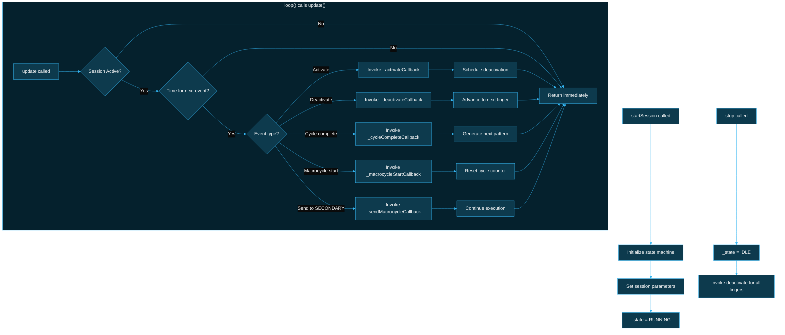

# BlueBuzzah Therapy Engine
**Version:** 2.0.0
**Date:** 2026-01-19
**Therapy Protocol:** Vibrotactile Coordinated Reset (vCR)
**Platform:** Arduino C++ / PlatformIO

---

## Table of Contents

1. [Therapy Overview](#therapy-overview)
2. [VCR Engine Architecture](#vcr-engine-architecture)
3. [Pattern Generation](#pattern-generation)
4. [Haptic Control](#haptic-control)
5. [Session Execution](#session-execution)
6. [Therapy Profiles](#therapy-profiles)
7. [DRV2605 Motor Control](#drv2605-motor-control)
8. [Performance Optimization](#performance-optimization)

---

## Terminology Note

This document uses the following device role terminology:
- **PRIMARY**: Generates patterns, controls therapy timing
- **SECONDARY**: Receives synchronization commands

Both devices run identical firmware and advertise as "BlueBuzzah". Role is determined by `settings.json` configuration. Code examples use `DeviceRole::PRIMARY` or `DeviceRole::SECONDARY` for device role parameters.

---

## Therapy Overview

### Vibrotactile Coordinated Reset (vCR)

**Clinical Foundation**: [PMC8055937](https://pmc.ncbi.nlm.nih.gov/articles/PMC8055937/)

**Mechanism**: Desynchronization of pathological neural oscillations in Parkinson's disease through bilateral vibrotactile stimulation.

**Key Parameters**:
- **Pattern**: Random permutations (RNDP) of 4 finger activations
- **Timing**: 100ms ON, 67ms OFF per finger (configurable)
- **Bilaterality**: Synchronized left/right glove stimulation
- **Jitter**: Temporal randomization to prevent habituation (0-50%)
- **Mirror Mode**: Symmetric vs independent L/R patterns
- **Session Duration**: 1-180 minutes (default: 120 minutes)

**Therapeutic Goal**: Reduce motor symptoms through coordinated reset stimulation

---

## VCR Engine Architecture

### Module Structure

**Files**:
- `src/therapy_engine.cpp` - Core therapy execution
- `include/therapy_engine.h` - Class declarations

**Key Class**: `TherapyEngine`

### Class Interface

TherapyEngine uses a **callback-driven architecture**. Hardware operations are decoupled from the engine—it generates patterns and timing, then invokes callbacks to perform actual motor activations.

```cpp
// include/therapy_engine.h

// Callback types
using ActivateCallback = std::function<void(uint8_t finger, uint8_t amplitude, uint16_t durationMs, uint16_t freqHz)>;
using DeactivateCallback = std::function<void(uint8_t finger)>;
using CycleCompleteCallback = std::function<void()>;
using SetFrequencyCallback = std::function<void(uint8_t finger, uint16_t freqHz)>;
using MacrocycleStartCallback = std::function<void()>;
using SendMacrocycleCallback = std::function<void(uint8_t sequenceNum, const MacrocycleMessage& msg)>;
using GetLeadTimeCallback = std::function<uint32_t()>;

class TherapyEngine {
public:
    TherapyEngine();  // Default constructor - no hardware dependencies

    // CALLBACKS - Set these before starting a session
    void setActivateCallback(ActivateCallback callback);
    void setDeactivateCallback(DeactivateCallback callback);
    void setCycleCompleteCallback(CycleCompleteCallback callback);
    void setSetFrequencyCallback(SetFrequencyCallback callback);
    void setMacrocycleStartCallback(MacrocycleStartCallback callback);
    void setSendMacrocycleCallback(SendMacrocycleCallback callback);
    void setSchedulingCallbacks(ScheduleActivationFn scheduleFn, GetMicrosecondsFn getMicrosFn);
    void setGetLeadTimeCallback(GetLeadTimeCallback callback);

    // Session control
    void startSession(uint32_t durationSec, PatternType patternType, float timeOnMs,
                      float timeOffMs, uint8_t amplitudeMin, uint8_t amplitudeMax,
                      uint16_t freqHz, float jitterPercent, bool mirror, bool randomFreq,
                      uint16_t freqLow, uint16_t freqHigh, bool isPrimary);
    void pause();
    void resume();
    void stop();

    // CRITICAL: Must call in loop() - drives the state machine
    void update();

    // State queries
    bool isRunning() const;
    bool isPaused() const;
    uint32_t getElapsedTime() const;
    uint32_t getMacrocycleCount() const;
    TherapyState getState() const;

private:
    // Callback storage
    ActivateCallback _activateCallback;
    DeactivateCallback _deactivateCallback;
    CycleCompleteCallback _cycleCompleteCallback;
    // ... (8 total callbacks)

    // Session state
    TherapyState _state;
    uint32_t _sessionStartMs;
    uint32_t _macrocycleCount;

    // Pattern generation
    uint8_t _currentPattern[4];

    // Internal methods
    void generatePattern();
    void advanceState();
    void scheduleNextActivation();
};
```

> **IMPORTANT:** The `update()` method MUST be called frequently in `loop()`. TherapyEngine does not use blocking delays—it uses a state machine that advances each time `update()` is called.

### Execution Flow (Callback-Driven)

TherapyEngine uses a **non-blocking state machine** driven by repeated calls to `update()`. No blocking delays are used—timing is managed through state transitions and callback invocations.



**Key Points:**
- `update()` MUST be called frequently in `loop()` (every 1-5ms)
- No `delay()` calls inside TherapyEngine—uses `millis()` comparisons
- All hardware operations are performed via callbacks, not direct calls
- FreeRTOS motor task handles precise timing of activations

---

## Pattern Generation

### Permutation Strategy (RNDP)

**Algorithm** (`src/therapy_engine.cpp`):

```cpp
// Pre-allocated permutation tables (compile-time constant)
// All 24 permutations of 4 elements (4! = 24)
static const uint8_t PERMUTATIONS[24][4] = {
    {0, 1, 2, 3}, {0, 1, 3, 2}, {0, 2, 1, 3}, {0, 2, 3, 1},
    {0, 3, 1, 2}, {0, 3, 2, 1}, {1, 0, 2, 3}, {1, 0, 3, 2},
    {1, 2, 0, 3}, {1, 2, 3, 0}, {1, 3, 0, 2}, {1, 3, 2, 0},
    {2, 0, 1, 3}, {2, 0, 3, 1}, {2, 1, 0, 3}, {2, 1, 3, 0},
    {2, 3, 0, 1}, {2, 3, 1, 0}, {3, 0, 1, 2}, {3, 0, 2, 1},
    {3, 1, 0, 2}, {3, 1, 2, 0}, {3, 2, 0, 1}, {3, 2, 1, 0}
};

void TherapyEngine::generatePattern(bool mirror) {
    // Select random permutation for left hand
    uint8_t leftIndex = random(24);
    memcpy(leftPattern_, PERMUTATIONS[leftIndex], 4);

    if (mirror) {
        // Mirrored: same finger sequence on both hands
        memcpy(rightPattern_, leftPattern_, 4);
    } else {
        // Independent: different random permutation for right hand
        uint8_t rightIndex = random(24);
        memcpy(rightPattern_, PERMUTATIONS[rightIndex], 4);
    }
}
```

**Pattern Space**:
- LEFT permutations: 4! = 24 patterns
- RIGHT permutations: 4! = 24 patterns (independent when non-mirrored)
- Total combinations (mirrored): 24 patterns (L determines R)
- Total combinations (non-mirrored): 24 × 24 = 576 unique patterns

**Bilateral Mirroring** (`src/therapy_engine.cpp`):

Mirroring is controlled by the `mirrorPattern` parameter based on vCR type:

| vCR Type | `mirrorPattern` | Behavior | Rationale |
|----------|-----------------|----------|-----------|
| Noisy vCR | `true` | Same finger on both hands | Avoids bilateral masking interference |
| Regular vCR | `false` | Independent sequences per hand | Increases spatial randomization for synaptic decoupling |

```cpp
void TherapyEngine::generateBuzzSequence(uint8_t* sequence, bool mirrorPattern) {
    // Generate PRIMARY device sequence using Fisher-Yates shuffle
    uint8_t primarySequence[NUM_FINGERS];
    for (uint8_t i = 0; i < NUM_FINGERS; i++) {
        primarySequence[i] = i;
    }
    shuffleArray(primarySequence, NUM_FINGERS);

    // Generate SECONDARY device sequence based on mirror setting
    uint8_t secondarySequence[NUM_FINGERS];
    if (mirrorPattern) {
        // Mirrored: same finger on both devices (for noisy vCR)
        memcpy(secondarySequence, primarySequence, NUM_FINGERS);
    } else {
        // Non-mirrored: independent random sequence (for regular vCR)
        for (uint8_t i = 0; i < NUM_FINGERS; i++) {
            secondarySequence[i] = i;
        }
        shuffleArray(secondarySequence, NUM_FINGERS);
    }

    // Combine into sequence buffer
    for (uint8_t i = 0; i < NUM_FINGERS; i++) {
        sequence[i * 2] = primarySequence[i];
        sequence[i * 2 + 1] = secondarySequence[i];
    }
}

// Fisher-Yates shuffle
void TherapyEngine::shuffleArray(uint8_t* array, uint8_t size) {
    for (uint8_t i = size - 1; i > 0; i--) {
        uint8_t j = random(i + 1);
        uint8_t temp = array[i];
        array[i] = array[j];
        array[j] = temp;
    }
}
```

Both hands use finger indices 0-3, with the hardware wiring ensuring each channel maps to the same anatomical finger on both gloves (channel 0 = index on both, etc.).

### Seed Synchronization

**Why Needed?** Both gloves must generate identical random patterns for bilateral symmetry.

**PRIMARY Sequence** (`src/therapy_engine.cpp`):

```cpp
bool TherapyEngine::synchronizeSeed() {
    if (config_.jitter == 0 || role_ != DeviceRole::PRIMARY) {
        return true;  // No sync needed
    }

    // 1. Generate seed from current time
    uint32_t sharedSeed = millis() % 1000000;

    // 2. Apply locally
    randomSeed(sharedSeed);

    // 3. Broadcast to SECONDARY
    char seedMsg[32];
    snprintf(seedMsg, sizeof(seedMsg), "SEED:%lu", sharedSeed);
    ble_.sendToSecondary(seedMsg);

    // 4. Wait for acknowledgment (2 second timeout)
    uint32_t ackStart = millis();
    while (millis() - ackStart < 2000) {
        if (ble_.hasSecondaryMessage()) {
            String response = ble_.readSecondaryMessage();
            if (response == "SEED_ACK") {
                return true;
            }
        }
        delay(10);
    }

    Serial.println(F("[PRIMARY] WARNING: No SEED_ACK - patterns may desync!"));
    return false;
}
```

**SECONDARY Sequence** (`src/therapy_engine.cpp`):

```cpp
bool TherapyEngine::waitForSeed() {
    if (config_.jitter == 0 || role_ != DeviceRole::SECONDARY) {
        return true;  // No sync needed
    }

    // 1. Wait for seed from PRIMARY (5 second timeout)
    uint32_t seedStart = millis();
    while (millis() - seedStart < 5000) {
        if (ble_.hasPrimaryMessage()) {
            String message = ble_.readPrimaryMessage();

            if (message.startsWith("SEED:")) {
                // 2. Extract and apply seed
                uint32_t sharedSeed = message.substring(5).toInt();
                randomSeed(sharedSeed);

                // 3. Send acknowledgment
                ble_.sendToPrimary("SEED_ACK");
                return true;
            }
        }
        delay(10);
    }

    Serial.println(F("[SECONDARY] WARNING: No seed received! Using default"));
    randomSeed(123456);  // Fallback to default
    return false;
}
```

**Why Only When JITTER != 0?**
- Without jitter: Pattern randomness from permutations only (deterministic per macrocycle)
- With jitter: TIME_OFF varies randomly, requiring synchronized RNG state

### Finger Mapping

**Physical Layout**:
```
LEFT GLOVE (PRIMARY):        RIGHT GLOVE (SECONDARY):
0: Index                     0: Index
1: Middle                    1: Middle
2: Ring                      2: Ring
3: Pinky                     3: Pinky
```

**Pattern Example** (non-mirrored):
```cpp
// Macrocycle 1: Generated sequence
uint8_t sequence[8] = {2, 1, 0, 3, 3, 0, 1, 2};
// Pairs: (L2,R1), (L0,R3), (L3,R0), (L1,R2)

// Execution sequence:
// Buzz 1: LEFT Ring   (2) + RIGHT Middle (1)
// Buzz 2: LEFT Index  (0) + RIGHT Pinky  (3)
// Buzz 3: LEFT Pinky  (3) + RIGHT Index  (0)
// Buzz 4: LEFT Middle (1) + RIGHT Ring   (2)
```

---

## Haptic Control

### HapticController Class

**Files**:
- `src/hardware.cpp` - Hardware implementation
- `include/hardware.h` - Class declarations

**Initialization** (`src/hardware.cpp`):

```cpp
class HapticController {
public:
    HapticController();

    bool begin();

    // Motor control
    void setMotorAmplitude(uint8_t channel, uint8_t amplitude);
    void allMotorsOff();
    void activate(uint8_t channel, uint8_t amplitude);
    void deactivate(uint8_t channel);

    // LED control
    void setLED(uint32_t color);
    void flashLED(uint32_t color, uint16_t durationMs, uint8_t count);

    // Battery
    float getBatteryVoltage();
    uint8_t getBatteryPercent();

private:
    Adafruit_DRV2605 drivers_[NUM_FINGERS];
    TCA9548A mux_;
    Adafruit_NeoPixel pixel_;

    bool initI2C();
    bool initMotors();
    void selectMuxChannel(uint8_t channel);
    void configureDriver(uint8_t channel, const TherapyConfig& config);
};
```

**I2C Hardware Setup** (`src/hardware.cpp`):

```cpp
bool HapticController::begin() {
    // 1. Initialize I2C bus at 400kHz
    Wire.begin();
    Wire.setClock(400000);

    // 2. Initialize TCA9548A multiplexer
    if (!mux_.begin(MUX_I2C_ADDR, Wire)) {
        Serial.println(F("ERROR: TCA9548A not found"));
        return false;
    }

    // 3. Initialize DRV2605 drivers on each mux channel
    for (uint8_t ch = 0; ch < NUM_FINGERS; ch++) {
        selectMuxChannel(ch);

        if (!drivers_[ch].begin()) {
            Serial.print(F("WARNING: DRV2605 not found on channel "));
            Serial.println(ch);
            continue;
        }

        // Configure for RTP mode
        configureDriver(ch, defaultConfig_);
    }

    // 4. Initialize NeoPixel LED
    pixel_.begin();
    pixel_.clear();
    pixel_.show();

    Serial.println(F("Hardware initialization complete"));
    return true;
}
```

### Motor Control Methods

**Activate Fingers** (`src/hardware.cpp`):

```cpp
void HapticController::fingersOn(const uint8_t* fingers, uint8_t count,
                                    uint8_t amplitudeMin, uint8_t amplitudeMax) {
    for (uint8_t i = 0; i < count; i++) {
        uint8_t channel = fingers[i];

        if (channel < NUM_FINGERS) {
            selectMuxChannel(channel);

            // Random amplitude within configured range
            uint8_t amplitude = random(amplitudeMin, amplitudeMax + 1);
            drivers_[channel].setRealtimeValue(amplitude);
        }
    }
}
```

**Deactivate Fingers** (`src/hardware.cpp`):

```cpp
void HapticController::fingersOff(const uint8_t* fingers, uint8_t count) {
    for (uint8_t i = 0; i < count; i++) {
        uint8_t channel = fingers[i];

        if (channel < NUM_FINGERS) {
            selectMuxChannel(channel);
            drivers_[channel].setRealtimeValue(0);
        }
    }
}
```

**Scheduling Activations** (`src/therapy_engine.cpp`):

The engine schedules activations via callbacks rather than executing them directly with blocking delays:

```cpp
void TherapyEngine::scheduleActivationsForCycle() {
    // Calculate base time for this cycle
    uint64_t baseTimeUs = _getLeadTimeCallback ? _getLeadTimeCallback() : 0;
    uint64_t currentTimeUs = _getMicrosCallback();

    // Schedule all 4 finger activations for this cycle
    for (uint8_t i = 0; i < NUM_FINGERS; i++) {
        uint8_t fingerIndex = _currentPattern[i];

        // Calculate timing with jitter
        uint32_t jitterUs = 0;
        if (_jitterPercent > 0) {
            int32_t maxJitter = (_timeOnMs + _timeOffMs) * _jitterPercent * 10 / 200;
            jitterUs = random(-maxJitter, maxJitter + 1) * 1000;
        }

        uint64_t activateTimeUs = currentTimeUs + baseTimeUs +
                                  (i * (_timeOnMs + _timeOffMs) * 1000) + jitterUs;

        // Invoke scheduling callback - queues to FreeRTOS motor task
        if (_scheduleActivationCallback) {
            _scheduleActivationCallback(activateTimeUs, fingerIndex,
                                       _amplitude, _timeOnMs, _freqHz);
        }
    }
}
```

> **Note:** No `delay()` calls are used. Timing is managed by the FreeRTOS motor task which executes events at their scheduled microsecond timestamps.

**Emergency Stop** (`src/hardware.cpp`):

```cpp
void HapticController::allMotorsOff() {
    for (uint8_t ch = 0; ch < NUM_FINGERS; ch++) {
        selectMuxChannel(ch);
        drivers_[ch].setRealtimeValue(0);
    }
}
```

### Random Frequency Reconfiguration

**Feature**: Optionally randomize actuator frequency each macrocycle

**Method** (`src/hardware.cpp`):

```cpp
void HapticController::reconfigureForRandomFrequency(const TherapyConfig& config) {
    if (!config.randomFreq) {
        return;
    }

    for (uint8_t ch = 0; ch < NUM_FINGERS; ch++) {
        selectMuxChannel(ch);

        // Set actuator type
        if (config.actuatorType == ActuatorType::LRA) {
            drivers_[ch].useLRA();
        } else {
            drivers_[ch].useERM();
        }

        // Enable open-loop mode
        uint8_t control3 = drivers_[ch].readRegister8(DRV2605_REG_CONTROL3);
        drivers_[ch].writeRegister8(DRV2605_REG_CONTROL3, control3 | 0x21);

        // Set peak voltage
        uint8_t voltageReg = (uint8_t)(config.actuatorVoltage / 0.02122f);
        drivers_[ch].writeRegister8(DRV2605_REG_OVERDRIVE, voltageReg);

        // Set driving frequency (randomized)
        uint16_t freq = random(config.freqLow, config.freqHigh + 1);
        freq = (freq / 5) * 5;  // Round to nearest 5 Hz
        uint8_t periodReg = (uint8_t)(1.0f / (freq * 0.00009849f));
        drivers_[ch].writeRegister8(DRV2605_REG_LRA_PERIOD, periodReg);

        // Activate RTP mode
        drivers_[ch].setRealtimeValue(0);
        drivers_[ch].setMode(DRV2605_MODE_REALTIME);
    }
}
```

**Performance Note**: Reinitializing drivers is expensive (~100-200ms). Only use when therapeutic benefit outweighs timing cost.

---

## Session Execution

### Callback-Driven Architecture

TherapyEngine uses a **callback-driven architecture** where the engine generates patterns and timing decisions, then invokes registered callbacks for actual hardware operations. This decouples the therapy logic from hardware dependencies.

**Callback Registration** (in `main.cpp`):

```cpp
void setup() {
    // Initialize hardware controllers
    hapticController.begin();
    ledController.begin();

    // Register callbacks - TherapyEngine never touches hardware directly
    therapyEngine.setActivateCallback([](uint8_t finger, uint8_t amplitude,
                                         uint16_t durationMs, uint16_t freqHz) {
        // Queue activation through FreeRTOS motor task for precise timing
        activationQueue.enqueue(getMicros() + leadTimeUs, finger, amplitude,
                               durationMs, freqHz);
    });

    therapyEngine.setDeactivateCallback([](uint8_t finger) {
        hapticController.deactivate(finger);
    });

    therapyEngine.setCycleCompleteCallback([]() {
        // Called after each 4-finger cycle completes
        latencyMetrics.recordCycleComplete();
    });

    therapyEngine.setMacrocycleStartCallback([]() {
        // Called at start of each macrocycle (3 cycles + relax)
        if (syncLedEnabled) {
            ledController.flash(COLOR_DARK_BLUE, 12);
        }
    });

    therapyEngine.setSendMacrocycleCallback([](uint8_t seq, const MacrocycleMessage& msg) {
        // PRIMARY: Send macrocycle to SECONDARY via BLE
        bleManager.sendMacrocycle(seq, msg);
    });

    therapyEngine.setSchedulingCallbacks(
        // Schedule activation function
        [](uint64_t timeUs, uint8_t finger, uint8_t amplitude,
           uint16_t durationMs, uint16_t freqHz) -> bool {
            return activationQueue.enqueue(timeUs, finger, amplitude,
                                          durationMs, freqHz);
        },
        // Get current microseconds function
        []() -> uint64_t {
            return getMicros();
        }
    );

    therapyEngine.setGetLeadTimeCallback([]() -> uint32_t {
        return syncProtocol.getLeadTimeUs();
    });
}
```

### Session Lifecycle

**Starting a Session:**

```cpp
// Called from menu_controller.cpp when START_SESSION received
void startTherapy(const TherapyConfig& config) {
    therapyEngine.startSession(
        config.sessionMinutes * 60,  // Duration in seconds
        config.patternType,
        config.timeOnMs,
        config.timeOffMs,
        config.amplitudeMin,
        config.amplitudeMax,
        config.freqHz,
        config.jitterPercent,
        config.mirror,
        config.randomFreq,
        config.freqLow,
        config.freqHigh,
        (deviceRole == DeviceRole::PRIMARY)
    );
}
```

**Main Loop Integration:**

```cpp
void loop() {
    // CRITICAL: Must call update() frequently for therapy to progress
    therapyEngine.update();

    // Other loop tasks...
    bleManager.update();
    syncProtocol.update();
}
```

**The `update()` Method:**

```cpp
void TherapyEngine::update() {
    if (_state != TherapyState::RUNNING) {
        return;  // Not active, nothing to do
    }

    uint32_t now = millis();

    // Check session duration
    if (now - _sessionStartMs >= _durationMs) {
        stop();
        return;
    }

    // Check if it's time for the next event
    if (now < _nextEventTimeMs) {
        return;  // Not yet time
    }

    // Execute the current event based on state machine
    switch (_currentPhase) {
        case Phase::ACTIVATE:
            // Generate activation parameters
            if (_activateCallback) {
                _activateCallback(_currentFinger, _amplitude,
                                 _durationMs, _freqHz);
            }
            _currentPhase = Phase::WAIT_ON;
            _nextEventTimeMs = now + _timeOnMs;
            break;

        case Phase::WAIT_ON:
            // Time to deactivate
            if (_deactivateCallback) {
                _deactivateCallback(_currentFinger);
            }
            advanceToNextFinger();
            break;

        case Phase::CYCLE_COMPLETE:
            if (_cycleCompleteCallback) {
                _cycleCompleteCallback();
            }
            startNextCycle();
            break;

        case Phase::MACROCYCLE_START:
            if (_macrocycleStartCallback) {
                _macrocycleStartCallback();
            }
            if (_isPrimary && _sendMacrocycleCallback) {
                MacrocycleMessage msg = buildMacrocycleMessage();
                _sendMacrocycleCallback(_sequenceNum, msg);
            }
            _currentPhase = Phase::ACTIVATE;
            break;
    }
}
```

### FreeRTOS Motor Task

Motor activations are executed by a dedicated FreeRTOS task for sub-millisecond precision:

```cpp
// FreeRTOS motor task (Priority 4)
void motorTaskFunction(void* pvParameters) {
    while (true) {
        MotorEvent event;
        if (activationQueue.getNextEvent(event)) {
            uint64_t now = getMicros();
            int64_t delayUs = event.timeUs - now;

            // Hybrid sleep + busy-wait for precision
            if (delayUs > 2000) {
                vTaskDelay(pdMS_TO_TICKS((delayUs - 2000) / 1000));
            }

            // Busy-wait for final precision
            while (getMicros() < event.timeUs) { /* spin */ }

            // Execute motor event
            executeMotorEvent(event);
        }
        vTaskDelay(1);
    }
}
```

**Key Features:**
- Non-blocking: BLE callbacks process during sleep
- Sub-millisecond precision through hybrid sleep + busy-wait
- I2C pre-selection reduces activation latency (~100μs vs ~500μs)

### Timing Breakdown Per Macrocycle

**Configuration** (default Noisy VCR):
- TIME_ON = 100ms
- TIME_OFF = 67ms
- JITTER = 23.5% = ±19.6ms
- TIME_RELAX = 4 * (TIME_ON + TIME_OFF) = 668ms

**One Macrocycle**:

```
Buzz Sequence 1:
  Finger 1: 100ms ON + 67ms OFF ±19.6ms jitter = 147-186ms
  Finger 2: 100ms ON + 67ms OFF ±19.6ms jitter = 147-186ms
  Finger 3: 100ms ON + 67ms OFF ±19.6ms jitter = 147-186ms
  Finger 4: 100ms ON + 67ms OFF ±19.6ms jitter = 147-186ms
  Total: 588-744ms (avg 666ms)

Buzz Sequence 2: 588-744ms
Buzz Sequence 3: 588-744ms

Relax Period 1: 668ms
Relax Period 2: 668ms

Total per macrocycle: 3100-3568ms (avg 3334ms = 3.3 seconds)
```

**Per Session** (120 minutes):

```
Macrocycles per session: (120 * 60) / 3.334 = 2,160 macrocycles
Total buzzes per glove: 2,160 * 3 * 4 = 25,920 finger activations
Total therapy time: ~108 minutes (12 minutes spent in relax periods)
```

---

## Therapy Profiles

### Profile Structure

**Files**:
- `src/profile_manager.cpp` - Profile loading/saving
- `include/profile_manager.h` - Profile definitions
- LittleFS storage for persistent profiles

**TherapyConfig Structure** (`include/types.h`):

```cpp
struct TherapyConfig {
    // Actuator Configuration
    ActuatorType actuatorType;     // LRA or ERM
    float actuatorVoltage;         // Peak voltage (1.0-3.3V)
    uint16_t actuatorFrequency;    // Nominal frequency (150-300 Hz)
    bool randomFreq;               // Randomize frequency per cycle
    uint16_t freqLow;              // Low frequency bound (Hz)
    uint16_t freqHigh;             // High frequency bound (Hz)

    // Amplitude Control
    uint8_t amplitudeMin;          // Minimum intensity (0-127)
    uint8_t amplitudeMax;          // Maximum intensity (0-127)

    // Timing Parameters
    uint16_t sessionMinutes;       // Session duration (1-180 minutes)
    uint16_t timeOnMs;             // Buzz duration (50-500 ms)
    uint16_t timeOffMs;            // Pause duration (20-200 ms)
    uint16_t relaxTimeMs;          // Relax between sequences
    uint8_t jitter;                // Temporal jitter (0-50%)

    // Pattern Configuration
    bool mirror;                   // Symmetric L/R patterns

    // Visual Feedback
    bool syncLed;                  // Flash LED at end of macrocycle
};

// Default configuration (Noisy VCR)
static const TherapyConfig DEFAULT_CONFIG = {
    .actuatorType = ActuatorType::LRA,
    .actuatorVoltage = 2.50f,
    .actuatorFrequency = 250,
    .randomFreq = false,
    .freqLow = 210,
    .freqHigh = 260,
    .amplitudeMin = 100,
    .amplitudeMax = 127,
    .sessionMinutes = 120,
    .timeOnMs = 100,
    .timeOffMs = 67,
    .relaxTimeMs = 668,
    .jitter = 24,  // 23.5% rounded
    .mirror = true,
    .syncLed = true
};
```

### Profile Comparison

| Profile | TIME_ON | TIME_OFF | JITTER | MIRROR | RANDOM_FREQ | Use Case |
|---------|---------|----------|--------|--------|-------------|----------|
| **Regular VCR** | 100ms | 67ms | 0% | False | No | Standard protocol, independent L/R |
| **Noisy VCR** | 100ms | 67ms | 23.5% | True | No | Default, prevents habituation |
| **Hybrid VCR** | 100ms | 67ms | 0% | False | Yes | Mixed frequency stimulation |
| **Custom VCR** | Variable | Variable | Variable | Variable | Variable | Research/experimental |

### Profile Switching

**Runtime Switching** (`src/menu_controller.cpp`):

```cpp
void MenuController::handleProfileLoad(uint8_t profileId) {
    // 1. Check if session is active
    if (stateMachine_.isRunning()) {
        ble_.sendError("Cannot modify parameters during active session");
        return;
    }

    // 2. Validate profile ID
    if (profileId < 1 || profileId > MAX_PROFILES) {
        ble_.sendError("Invalid profile ID");
        return;
    }

    // 3. Load profile via ProfileManager
    TherapyConfig config;
    if (!profileManager_.loadProfile(profileId, config)) {
        ble_.sendError("Failed to load profile");
        return;
    }

    currentConfig_ = config;

    // 4. Respond to phone
    char response[64];
    snprintf(response, sizeof(response),
             "{\"STATUS\":\"LOADED\",\"PROFILE\":\"%s\"}",
             profileManager_.getProfileName(profileId));
    ble_.sendToPhone(response);

    // 5. Sync to SECONDARY if PRIMARY
    if (role_ == DeviceRole::PRIMARY) {
        broadcastConfigUpdate(config);
    }
}
```

**Note**: Profile changes only affect **next session**. Active sessions cannot be modified.

---

## DRV2605 Motor Control

### Register Configuration

**DRV2605 Key Registers**:

| Register | Address | Function | Value | Notes |
|----------|---------|----------|-------|-------|
| STATUS | 0x00 | Status/Go bit | 0x01 | Trigger playback |
| MODE | 0x01 | Operating mode | 0x05 | Real-time playback (RTP) |
| RTP_INPUT | 0x02 | RTP amplitude | 0-127 | 7-bit value |
| FEEDBACK_CTRL | 0x1A | N_ERM/LRA select | 0x00=ERM, 0x80=LRA | Actuator type |
| CONTROL3 | 0x1D | Advanced control | 0x21 | Open-loop enable |
| OD_CLAMP | 0x17 | Overdrive clamp | 0-255 | Peak voltage limit |
| LRA_RESONANCE_PERIOD | 0x20 | LRA period | Calculated | Driving frequency |

### Driver Configuration Sequence

**Method** (`src/hardware.cpp`):

```cpp
void HapticController::configureDriver(uint8_t channel, const TherapyConfig& config) {
    selectMuxChannel(channel);
    Adafruit_DRV2605& drv = drivers_[channel];

    // 1. Set actuator type (LRA vs ERM)
    if (config.actuatorType == ActuatorType::LRA) {
        drv.useLRA();  // Sets FEEDBACK_CTRL[7] = 1
    } else {
        drv.useERM();  // Sets FEEDBACK_CTRL[7] = 0
    }

    // 2. Enable open-loop mode (disable auto-resonance)
    uint8_t control3 = drv.readRegister8(DRV2605_REG_CONTROL3);
    drv.writeRegister8(DRV2605_REG_CONTROL3, control3 | 0x21);
    // Bit 5: N_PWM_ANALOG (open-loop)
    // Bit 0: LRA_OPEN_LOOP

    // 3. Set peak voltage (overdrive clamp)
    // Formula: Voltage = Register * 0.02122V
    // Range: 0-255 (0-5.6V)
    uint8_t voltageValue = (uint8_t)(config.actuatorVoltage / 0.02122f);
    drv.writeRegister8(DRV2605_REG_OVERDRIVE, voltageValue);
    // Example: 2.50V -> 2.50 / 0.02122 = 118

    // 4. Set driving frequency (LRA resonance period)
    // Formula: Period = 1 / (Frequency * 0.00009849)
    // Range: 150-300 Hz typical for LRAs
    uint8_t periodValue = (uint8_t)(1.0f / (config.actuatorFrequency * 0.00009849f));
    drv.writeRegister8(DRV2605_REG_LRA_PERIOD, periodValue);
    // Example: 250 Hz -> 1 / (250 * 0.00009849) = 41

    // 5. Set initial amplitude and activate RTP mode
    drv.setRealtimeValue(0);  // Start silent
    drv.setMode(DRV2605_MODE_REALTIME);  // 0x05
}
```

### Real-Time Playback (RTP) Mode

**Why RTP?**
- Direct amplitude control (0-127)
- No waveform library needed
- Minimal latency (~1ms)
- Precise timing control

**Amplitude Mapping**:

```cpp
// User intensity (0-100%) -> DRV2605 value (0-127)
uint8_t drvIntensity = (uint8_t)((intensity / 100.0f) * 127);

// Examples:
// 0%   -> 0   (motor off)
// 50%  -> 63  (half power)
// 100% -> 127 (full power)
```

**RTP Update Sequence**:

```cpp
// 1. Select motor channel via multiplexer
selectMuxChannel(fingerIndex);

// 2. Set amplitude
drivers_[fingerIndex].setRealtimeValue(63);  // 50% intensity

// 3. Motor responds within ~1ms

// 4. Stop motor
drivers_[fingerIndex].setRealtimeValue(0);
```

### I2C Multiplexer Routing

**Hardware Setup**:

```
nRF52840 I2C Bus (SCL/SDA)
  |
  +-- TCA9548A Multiplexer (0x70)
        |-- Port 0: DRV2605 #1 (Index)   @ 0x5A
        |-- Port 1: DRV2605 #2 (Middle)  @ 0x5A
        |-- Port 2: DRV2605 #3 (Ring)    @ 0x5A
        +-- Port 3: DRV2605 #4 (Pinky)   @ 0x5A
```

**Why Multiplexer?** All DRV2605 chips have fixed address 0x5A. Multiplexer allows 4 chips on same bus.

**Channel Selection** (`src/hardware.cpp`):

```cpp
void HapticController::selectMuxChannel(uint8_t channel) {
    if (channel >= NUM_FINGERS) return;
    mux_.selectChannel(channel);
}

// Usage example
void HapticController::setMotorAmplitude(uint8_t channel, uint8_t amplitude) {
    selectMuxChannel(channel);
    drivers_[channel].setRealtimeValue(amplitude);
}
```

---

## Performance Optimization

### Memory Efficiency

**Static Allocation Strategy**:

```cpp
// Permutation table in flash (PROGMEM) - zero RAM usage
static const uint8_t PERMUTATIONS[24][4] PROGMEM = {
    {0, 1, 2, 3}, {0, 1, 3, 2}, {0, 2, 1, 3}, /* ... */
};

// Pre-allocated pattern buffers
class TherapyEngine {
    uint8_t leftPattern_[NUM_FINGERS];   // 4 bytes
    uint8_t rightPattern_[NUM_FINGERS];  // 4 bytes
    // No heap allocation during therapy execution
};
```

**Memory Budget**:

```
Static Allocations:
  - Pattern tables (PROGMEM): 96 bytes flash
  - Pattern buffers: 8 bytes RAM
  - Driver objects: ~400 bytes RAM
  - BLE buffers: ~1KB RAM
  - Config structure: ~64 bytes RAM

Total firmware footprint: ~150KB flash, ~50KB RAM
Available: 1MB flash, 256KB RAM -> Plenty of headroom
```

### Timing Optimization

**Critical Path** (FreeRTOS motor task):

```cpp
// Motor task timing breakdown:
// 1. Event dequeue: <10μs
// 2. I2C channel select: ~100μs (pre-selection reduces from ~500μs)
// 3. DRV2605 RTP write: ~100-200μs
// 4. Total per activation: ~200-300μs

// Hybrid sleep + busy-wait for precision:
void motorTaskFunction(void* pvParameters) {
    while (true) {
        MotorEvent event;
        if (activationQueue.getNextEvent(event)) {
            int64_t delayUs = event.timeUs - getMicros();

            // Sleep for bulk of delay (saves power)
            if (delayUs > 2000) {
                vTaskDelay(pdMS_TO_TICKS((delayUs - 2000) / 1000));
            }

            // Busy-wait for final precision (~1-2μs accuracy)
            while (getMicros() < event.timeUs) { /* spin */ }

            // Execute - I2C channel pre-selected for speed
            hapticController.activate(event.finger, event.amplitude);
        }
        vTaskDelay(1);
    }
}
```

> **Note:** No blocking delays in TherapyEngine. All timing is managed by the FreeRTOS motor task which achieves sub-millisecond precision.

**Non-Blocking BLE Handling**:

```cpp
// Good: Non-blocking message check
void TherapyEngine::checkForCommands() {
    if (ble_.hasMessage()) {
        String msg = ble_.readMessage();
        processCommand(msg);
    }
    // Continues immediately if no message
}

// Bad: Blocking read (avoid in therapy loop)
// String msg = ble_.readMessageBlocking();  // DON'T DO THIS
```

### I2C Bus Optimization

**Frequency Selection**:

```cpp
// 400kHz Fast Mode - optimal for short wires
Wire.setClock(400000);

// If signal integrity issues, fall back to:
// 100kHz Standard Mode
// Wire.setClock(100000);
```

**Batch Operations**:

```cpp
// Good: Minimize channel switches
void HapticController::allMotorsOff() {
    for (uint8_t ch = 0; ch < NUM_FINGERS; ch++) {
        selectMuxChannel(ch);  // 1 switch per motor
        drivers_[ch].setRealtimeValue(0);
    }
}

// Total I2C time: ~2ms for all 4 motors
```

---

## Clinical Considerations

### Therapeutic Parameters

**Optimal Settings** (based on research):
- **Frequency**: 250 Hz (matches LRA resonance)
- **Amplitude**: 100% (maximum sensation without pain)
- **ON/OFF ratio**: 100ms/67ms (3:2 ratio)
- **Jitter**: 23.5% (prevents habituation)
- **Session duration**: 120 minutes (2 hours)
- **Pattern**: Random permutations (non-predictable)

### Safety Features

1. **Battery monitoring**: Alert at <3.3V
2. **Connection timeout**: Halt therapy if PRIMARY disconnects (10s)
3. **Emergency stop**: `allMotorsOff()` immediately stops all motors
4. **Visual feedback**: LED indicators for errors
5. **Authorization token**: Prevents unauthorized device use

### Bilateral Synchronization

**Importance**: Both hands must stimulate simultaneously for optimal neural desynchronization.

**Achieved Synchronization**: <1ms bilateral sync (sub-millisecond precision via FreeRTOS motor task)

**Verification**:

```cpp
// Enable SYNC_LED in profile
config.syncLed = true;  // Flash LED at end of each macrocycle

// Observe LED timing:
// - Both gloves should flash within 20ms of each other
// - If >50ms lag, check BLE connection quality
```

---

## Troubleshooting

### Motor Not Activating

**Diagnostic Checklist**:

1. **Check I2C connection**:
   ```
   Serial output should show:
   "TCA9548A found at 0x70"
   "DRV2605 found on channel 0"
   ```

2. **Check driver initialization**:
   ```
   Serial output should show:
   "Hardware initialization complete"
   ```

3. **Check voltage setting**:
   ```cpp
   // Ensure actuatorVoltage >= 2.0V
   // Too low = weak/no sensation
   ```

4. **Check frequency**:
   ```cpp
   // Ensure actuatorFrequency matches LRA resonance (~250 Hz)
   // Off-resonance = weak sensation
   ```

### Synchronization Drift

**Symptoms**: PRIMARY and SECONDARY buzz at noticeably different times

**Causes**:
1. BLE connection interval >7.5ms
2. MACROCYCLE timeout (check SECONDARY serial logs)
3. Pattern desync (check SEED_ACK received)

**Fix**:
```
Restart both gloves
Monitor serial output for:
"[PRIMARY] Sent MACROCYCLE:0"
"[SECONDARY] Received MACROCYCLE:0"
Time delta should be <20ms
```

### Session Not Completing

**Symptoms**: Therapy runs indefinitely

**Causes**:
1. Session duration calculation error
2. `running_` flag not checked
3. Clock overflow (after ~50 days uptime)

**Fix**:
```cpp
// Verify session duration calculation
uint32_t sessionDurationMs = config_.sessionMinutes * 60UL * 1000UL;
// Use UL suffix for proper 32-bit math
```

---

## Future Enhancements

### Potential Improvements

1. **Adaptive Jitter**: Adjust jitter based on therapy progress
2. **Multi-Frequency Stimulation**: Simultaneously drive different fingers at different frequencies
3. **Closed-Loop Control**: Adjust amplitude based on measured motor response
4. **Session Logging**: Record buzz patterns to LittleFS storage
5. **Resume After Disconnect**: Save session state for recovery

### Research Extensions

1. **Frequency Sweeps**: Gradual frequency changes during session
2. **Phase-Shifted Patterns**: Introduce phase delays between fingers
3. **Intensity Ramps**: Gradual amplitude increase/decrease
4. **Personalized Profiles**: Machine learning-optimized parameters

---

## See Also

- **[SYNCHRONIZATION_PROTOCOL.md](SYNCHRONIZATION_PROTOCOL.md)** - PRIMARY ↔ SECONDARY MACROCYCLE coordination
- **[CALIBRATION_GUIDE.md](CALIBRATION_GUIDE.md)** - Motor intensity calibration workflow
- **[ARCHITECTURE.md](ARCHITECTURE.md)** - Hardware reference and DRV2605 specs
- **[BLE_PROTOCOL.md](BLE_PROTOCOL.md)** - Session control and parameter adjustment commands
- **[API_REFERENCE.md](API_REFERENCE.md)** - TherapyEngine module API

---

**Document Maintenance:**
Update this document when:
- Modifying therapy algorithms or pattern generation
- Changing DRV2605 configuration parameters
- Adding new therapy profiles
- Updating timing constants
- Modifying haptic control logic

**Last Updated:** 2026-01-19
**Therapy Protocol Version:** vCR 1.0
**Platform:** Arduino C++ / PlatformIO
