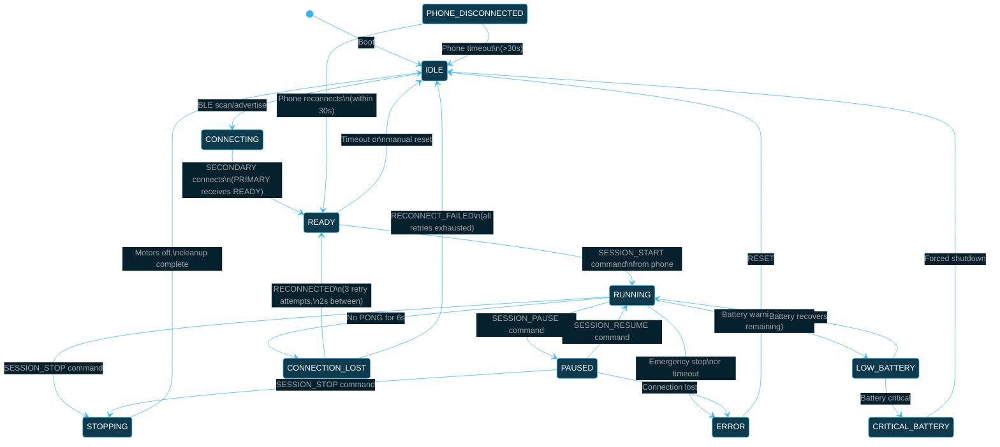
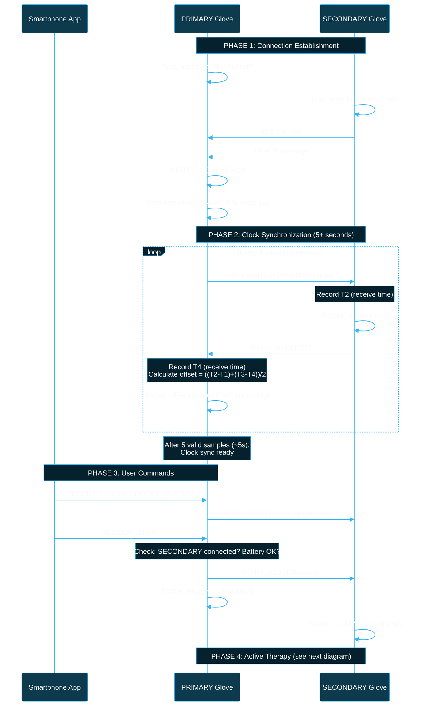
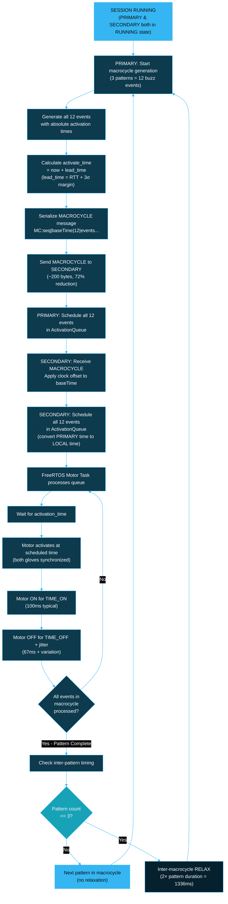
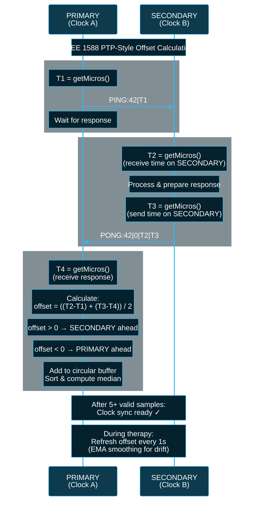
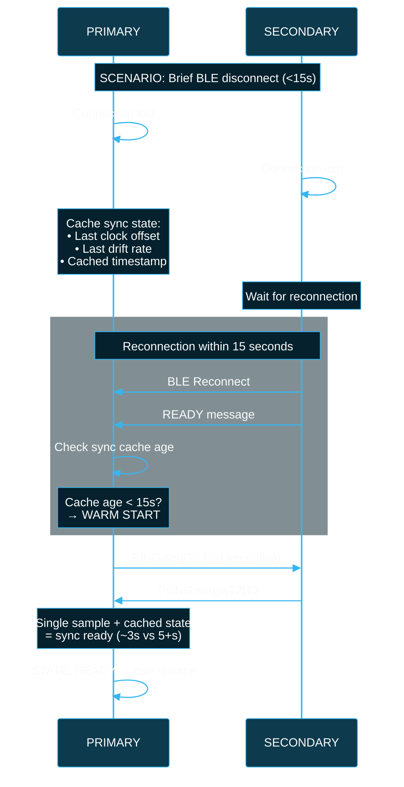
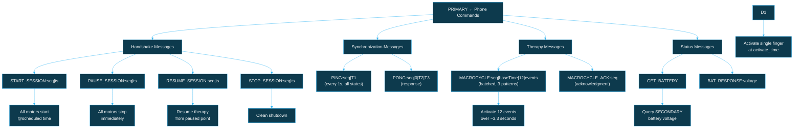
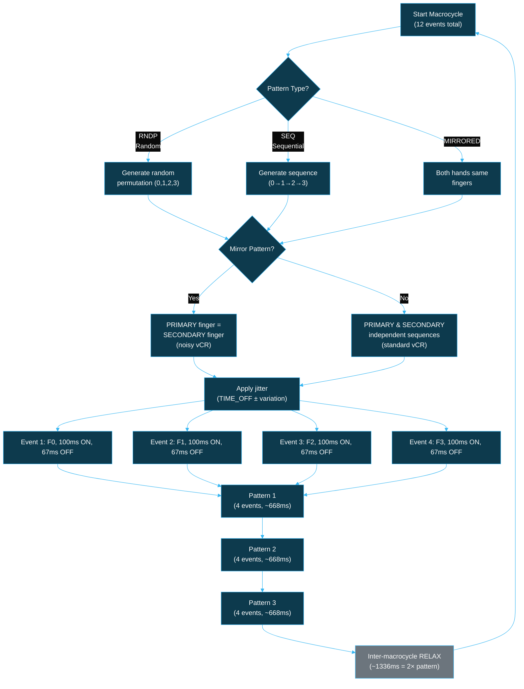
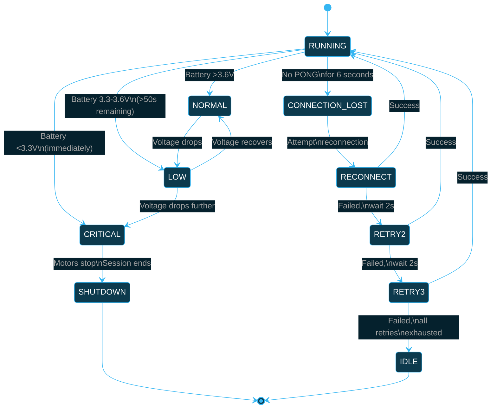
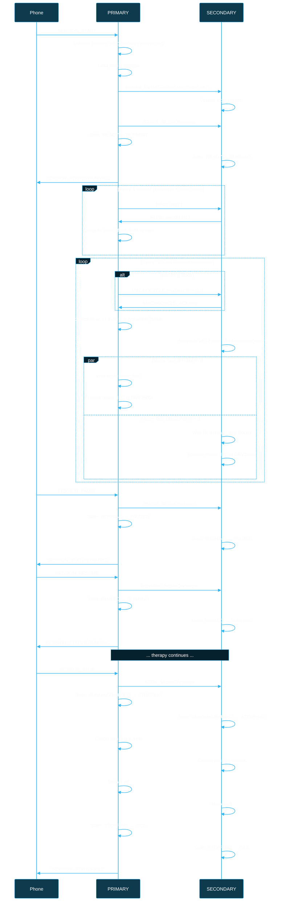

# Therapy Session Flow & Device Communication

This document provides comprehensive visual diagrams of the BlueBuzzah therapy session lifecycle, firmware responsibilities, and PRIMARY ↔ SECONDARY device communication.

## Overview

The BlueBuzzah system uses a dual-glove architecture with synchronized bilateral haptic feedback:

- **PRIMARY glove**: Connects to smartphone, generates therapy patterns, coordinates SECONDARY
- **SECONDARY glove**: Receives commands from PRIMARY, executes synchronized motor activations
- **Synchronization**: IEEE 1588 PTP-style clock offset calculation achieves <2ms bilateral sync
- **Communication**: BLE UART service for phone ↔ PRIMARY, custom sync protocol for PRIMARY ↔ SECONDARY

---

## 1. Session Lifecycle State Machine

The therapy session follows an 11-state finite state machine with graceful error handling:



**State Descriptions:**

| State                | Description                                             |
| -------------------- | ------------------------------------------------------- |
| `IDLE`               | System initialized, no connections                      |
| `CONNECTING`         | BLE scanning/advertising for device pairing             |
| `READY`              | Devices connected, synchronized, awaiting session start |
| `RUNNING`            | Active therapy session, motors executing patterns       |
| `PAUSED`             | Session paused, motors idle, timing preserved           |
| `STOPPING`           | Graceful shutdown in progress                           |
| `ERROR`              | Error condition, requires reset                         |
| `LOW_BATTERY`        | Battery low (`3.3-3.6V`), continue with warning         |
| `CRITICAL_BATTERY`   | Battery critical (`<3.3V`), forced shutdown             |
| `CONNECTION_LOST`    | SECONDARY disconnected, attempting reconnection         |
| `PHONE_DISCONNECTED` | Phone disconnected, gloves remain paired                |

---

## 2. Session Initialization Sequence

Complete boot-to-ready sequence including connection establishment and clock synchronization:



---

## 3. Active Therapy Session Flow

Pattern generation, message batching, and motor scheduling during an active session:



**Key Metrics:**

- Pattern duration: ~668ms (4 events × 167ms average)
- Macrocycle duration: ~3.3s (3 patterns + relaxation)
- Batching efficiency: 72% bandwidth reduction (200 bytes vs 720 bytes)

---

## 4. Clock Synchronization (PTP 4-Timestamp)

IEEE 1588 PTP-style clock offset calculation for sub-2ms bilateral synchronization:



**Offset Calculation Formula:**

```
offset = ((T2 - T1) + (T3 - T4)) / 2
RTT = (T4 - T1) - (T3 - T2)
```

**Synchronization Parameters:**

- **Target accuracy**: <2ms bilateral sync
- **Confidence threshold**: RTT < 80ms
- **Minimum samples**: 5 for sync ready
- **Smoothing**: Exponential moving average (α = 0.2)
- **Update frequency**: Every 1 second (with keepalive)

### Warm-Start Sync Recovery

After brief BLE disconnects, the firmware can skip full clock synchronization using cached sync state:



**Warm-Start Conditions:**

| Condition | Warm-Start | Cold-Start |
|-----------|:----------:|:----------:|
| Disconnect duration < 15s | ✓ | ✗ |
| Disconnect duration ≥ 15s | ✗ | ✓ |
| First connection (no cache) | ✗ | ✓ |
| Device reboot | ✗ | ✓ |

**Recovery Time Comparison:**

| Start Type | Required Samples | Time to Sync Ready |
|------------|:----------------:|:------------------:|
| Cold-Start | 5+ samples | ~5+ seconds |
| Warm-Start | 1-2 samples | ~2-3 seconds |

**Sync Cache Contents:**

```cpp
struct SyncCache {
    int32_t lastClockOffset;      // Microseconds offset
    float lastDriftRate;          // us/ms drift compensation
    uint32_t cachedTimestamp;     // When cache was written
    uint8_t confidenceLevel;      // Sample quality indicator
};

// From config.h:
// SYNC_WARM_START_VALIDITY_MS = 15000 (15 seconds)
```

**Purpose:** Warm-start significantly improves therapy continuity after transient BLE issues (interference, temporary out-of-range) by avoiding full re-synchronization.

---

## 5. Synchronized Motor Activation

How both gloves achieve sub-2ms synchronization despite BLE latency:

```mermaid
%%{init: {'theme': 'base', 'themeVariables': {
  'primaryColor': '#0d3a4d',
  'primaryTextColor': '#fafafa',
  'primaryBorderColor': '#35B6F2',
  'lineColor': '#35B6F2',
  'secondaryColor': '#05212D',
  'tertiaryColor': '#0a0a0a',
  'background': '#0a0a0a',
  'mainBkg': '#0d3a4d',
  'nodeBorder': '#35B6F2',
  'clusterBkg': '#05212D',
  'clusterBorder': '#35B6F2',
  'titleColor': '#fafafa',
  'edgeLabelBackground': '#0a0a0a'
}}}%%
flowchart LR
    subgraph PRIMARY["PRIMARY (0ms reference)"]
        A["1. Generate macrocycle<br/>t=500ms"]
        B["2. baseTime<br/>= 500ms + lead_time<br/>= 550ms"]
        C["3. Send MACROCYCLE<br/>(12 events)"]
        D["4. Schedule all in queue<br/>baseTime=550ms"]
    end

    subgraph BLE["Bluetooth Latency<br/>(~7.5-20ms)"]
        E["Transit (7.5-20ms)"]
    end

    subgraph SECONDARY["SECONDARY (offset=-1ms)"]
        F["5. Receive MACROCYCLE<br/>(550ms PRIMARY time)"]
        G["6. Convert to LOCAL<br/>time = 550ms + (-1ms)<br/>= 549ms"]
        H["7. Schedule all in queue<br/>baseTime=549ms"]
        I["8. Wait for 549ms"]
    end

    subgraph EXECUTION["Motor Activation"]
        J["Both motors activate<br/>within <2ms of each other"]
    end

    A --> B --> C --> E --> F --> G --> H --> I --> J
    C --> D --> J
    D -.->|Waits for<br/>550ms| J
    I -.->|Waits for<br/>549ms| J
```



**Key Insight:** By scheduling events with absolute activation times (in PRIMARY's timebase) and applying clock offset conversion on SECONDARY, the system decouples synchronization accuracy from BLE transmission latency.

---

## 6. Message Types & Flow

All messages exchanged between devices during a therapy session:



**Message Routing:**

- **Phone → PRIMARY**: BLE UART service (Nordic UART Service)
- **PRIMARY → SECONDARY**: Custom sync protocol over BLE UART
- **Keepalive**: PING/PONG every 1s in all connected states

---

## 7. Pattern Generation (RNDP/SEQUENTIAL/MIRRORED)

How the firmware generates vibrotactile patterns (3 patterns = 1 macrocycle):



**Pattern Types:**

- **RNDP (Random Permutation)**: Finger order randomized each pattern
- **SEQUENTIAL**: Fingers activate in order (0→1→2→3 or reverse)
- **MIRRORED**: Both hands use identical finger sequences (noisy vCR mode)

**Timing:**

- Event duration: TIME_ON (100ms) + TIME_OFF (67ms) + jitter
- Pattern duration: 4 events × ~167ms = ~668ms
- Macrocycle: 3 patterns + 1336ms relaxation = ~3.3s

---

## 8. Battery & Error Handling

Battery monitoring and error recovery flows:



**Battery Thresholds:**

- **Normal**: >3.6V (full operation)
- **Low**: 3.3-3.6V (warning, >50s estimated remaining)
- **Critical**: <3.3V (immediate forced shutdown)

**Connection Loss Handling:**

- **Detection**: 6 seconds without PONG response (3 missed keepalives)
- **Reconnection**: 3 attempts with 2s intervals
- **Timeout**: Return to IDLE after all retries exhausted

---

## 9. Lead Time Calculation (Adaptive Scheduling)

Dynamic lead time adjustment based on measured BLE latency:

```mermaid
%%{init: {'theme': 'base', 'themeVariables': {
  'primaryColor': '#0d3a4d',
  'primaryTextColor': '#fafafa',
  'primaryBorderColor': '#35B6F2',
  'lineColor': '#35B6F2',
  'secondaryColor': '#05212D',
  'tertiaryColor': '#0a0a0a',
  'background': '#0a0a0a',
  'mainBkg': '#0d3a4d',
  'nodeBorder': '#35B6F2',
  'clusterBkg': '#05212D',
  'clusterBorder': '#35B6F2',
  'titleColor': '#fafafa',
  'edgeLabelBackground': '#0a0a0a'
}}}%%
flowchart TD
    A["Receive RTT measurement<br/>from PING/PONG cycle"]

    B["Calculate one-way latency<br/>latency = RTT / 2"]

    C["Apply EMA smoothing<br/>smooth_lat = α×measured + (1-α)×prev"]

    D["Calculate variance<br/>σ² = deviation from smoothed"]

    E["Compute lead time<br/>lead_time = smooth_lat + 3σ"]

    F["Clamp to bounds<br/>70ms ≤ lead_time ≤ 150ms"]

    G["Use for MACROCYCLE events<br/>baseTime = now + lead_time"]

    A --> B --> C --> D --> E --> F --> G

    Note over A: Minimum: 70ms (SYNC_MIN_LEAD_TIME_US)<br/>Maximum: 150ms (SYNC_MAX_LEAD_TIME_US)

    style E fill:#17a2b8,color:#fafafa
    style F fill:#35B6F2,color:#0a0a0a
```

**Lead Time Formula:**

```
lead_time = RTT/2 + processing_overhead + margin
lead_time = clamp(lead_time, 70ms, 150ms)

// From config.h:
// SYNC_MIN_LEAD_TIME_US = 70000  (70ms minimum)
// SYNC_MAX_LEAD_TIME_US = 150000 (150ms maximum)
```

**Purpose:** Ensures SECONDARY has sufficient time to receive, deserialize, and schedule events before activation. The 70-150ms range accounts for:
- BLE round-trip time (~16-24ms for 2M PHY)
- Processing overhead (SYNC_PROCESSING_OVERHEAD_US = 10ms)
- Generation overhead (SYNC_GENERATION_OVERHEAD_US = 5ms)
- Safety margin for BLE retransmissions

---

## 10. Complete BLE Command Sequence

Full message flow from phone command to synchronized motor execution:



---

## Firmware Responsibilities

| Responsibility                        | PRIMARY | SECONDARY |
| ------------------------------------- | :-----: | :-------: |
| **Pattern generation**                |    ✓    |     ✗     |
| **Phone communication**               |    ✓    |     ✗     |
| **Clock synchronization (initiator)** |    ✓    |     ✗     |
| **Clock synchronization (responder)** |    ✗    |     ✓     |
| **Lead time calculation**             |    ✓    |     ✗     |
| **Therapy command distribution**      |    ✓    |     ✗     |
| **Therapy command execution**         |    ✓    |     ✓     |
| **Battery monitoring (both gloves)**  |    ✓    |     ✗     |
| **Battery voltage reporting**         |    ✓    |     ✓     |
| **Motor activation**                  |    ✓    |     ✓     |
| **Session state authority**           | Master  | Follower  |

---

## Technical Parameters

### Timing Values

| Parameter             | Value   | Description                               |
| --------------------- | ------- | ----------------------------------------- |
| TIME_ON               | 100ms   | Motor activation duration (per event)     |
| TIME_OFF              | 67ms    | Inter-burst interval (base value)         |
| Lead time             | 70-150ms | Adaptive scheduling margin (config.h bounds) |
| Pattern duration      | ~668ms  | 4 events × (TIME_ON + TIME_OFF + jitter)  |
| Macrocycle duration   | ~3.3s   | 3 patterns + inter-macrocycle relaxation  |
| Relaxation period     | ~1336ms | 2× pattern duration (between macrocycles) |
| PING/PONG frequency   | 1s      | Keepalive and clock sync refresh rate     |
| Connection timeout    | 6s      | 3 missed PING/PONGs triggers reconnection |
| Reconnection interval | 2s      | Delay between reconnection attempts       |
| Reconnection attempts | 3       | Maximum retries before returning to IDLE  |

### Synchronization Accuracy

| Metric                 | Value                     | Notes                                   |
| ---------------------- | ------------------------- | --------------------------------------- |
| Target accuracy        | <2ms                      | Bilateral synchronization (both gloves) |
| Synchronization method | IEEE 1588 PTP 4-timestamp | Clock offset calculation                |
| Confidence threshold   | RTT < 80ms                | For accepting offset samples            |
| Minimum samples        | 5                         | Before declaring sync ready             |
| Smoothing algorithm    | EMA (α = 0.2)             | Exponential moving average              |
| Update frequency       | 1 Hz                      | Every PING/PONG cycle                   |

### Message Efficiency

| Mode                | Message Size | Messages/Macrocycle | Total Bytes | Efficiency        |
| ------------------- | ------------ | ------------------- | ----------- | ----------------- |
| Individual messages (removed) | 60 bytes | 12            | 720 bytes   | Removed (legacy)  |
| MACROCYCLE batching | 200 bytes    | 1                   | 200 bytes   | **72% reduction** |

### Battery Thresholds

| Level    | Voltage Range | Remaining Time | Action                        |
| -------- | ------------- | -------------- | ----------------------------- |
| Normal   | >3.6V         | Full           | Normal operation              |
| Low      | 3.3-3.6V      | >50s           | Warning, continue             |
| Critical | <3.3V         | <50s           | **Immediate forced shutdown** |

---

## Related Documentation

This document complements the following technical documentation:

- **[ARDUINO_FIRMWARE_ARCHITECTURE.md](./ARDUINO_FIRMWARE_ARCHITECTURE.md)** - Complete firmware architecture overview
- **[SYNCHRONIZATION_PROTOCOL.md](./SYNCHRONIZATION_PROTOCOL.md)** - Detailed PRIMARY ↔ SECONDARY sync protocol specification
- **[BLE_PROTOCOL.md](./BLE_PROTOCOL.md)** - Phone ↔ PRIMARY BLE command protocol
- **[COMMAND_REFERENCE.md](./COMMAND_REFERENCE.md)** - All 18 BLE commands with syntax and examples

---

## Summary

The BlueBuzzah firmware implements a sophisticated bilateral synchronization system:

1. **Dual-glove architecture** with PRIMARY/SECONDARY roles for coordinated therapy
2. **IEEE 1588 PTP-style clock synchronization** achieving <2ms bilateral sync accuracy
3. **Adaptive lead time scheduling** that decouples sync accuracy from BLE latency variability
4. **Message batching (MACROCYCLE)** reducing BLE bandwidth by 72%
5. **Graceful error handling** with automatic reconnection and battery failsafes
6. **FreeRTOS task isolation** for deterministic motor timing (<1ms activation accuracy)

This architecture enables precise bilateral haptic feedback while operating within the constraints of BLE latency (7.5-20ms typical) and embedded hardware limitations (256KB RAM, 1MB flash).
